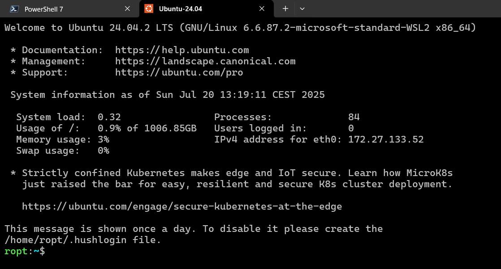
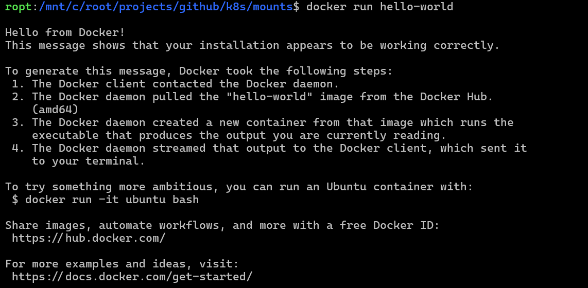

# Getting started with Kubernetes

This page introduces the basics to start learning Kubernetes:

- [X] Preparing a development environment.
- [X] Recommended learning resources for beginners.
- [X] Obtaining the examples of this repository.

## Preparing a development environment

To work with **Docker** and **Kubernetes**, I always used **Ubuntu** and the **CLI**
tools, without graphical user interfaces. I started using Docker in 2015. At that time,
Docker was only supported on Linux and there was no [_Docker Desktop_](https://docs.docker.com/desktop/).
Today I am still using the CLI, and I can recommend it. I have no interest in using
_Docker Desktop_, nor in using Docker on _Windows_.

I don't talk about [Podman](https://podman.io/), because I never used it, but I heard
it is a good alternative to Docker.

/// admonition | Docker Desktop can require a paid license.
    type: warning

Docker Desktop requires a paid license for professional use in organizations with more
than 250 employees or more than $10 million in annual revenue. Smaller businesses,
personal use, education, and non-commercial open source projects can still use Docker
Desktop for free.

You can use the Docker CLI (command-line interface) for free also for commercial use.

///

---

To learn Docker, I recommend having:

- A personal laptop or desktop with **Ubuntu 24.04** installed directly as main
  operating system.
- Alternatively, a Windows machine with **WSL** and **Ubuntu 24.04** installed.

I work successfully with both, and installing the tools was easy in both cases.

### Installing Ubuntu as main OS.

To install Ubuntu as main operating system, you can download the ISO from
[ubuntu.com](https://ubuntu.com/download/desktop) and follow the instructions to create
a bootable USB drive.

Creating a bootable USB drive can be done using tools like
[balenaEtcher](https://etcher.balena.io/). **balenaEtcher** is available for Windows,
macOS, and Linux, and is easy to use.

Enter the BIOS/UEFI settings of your computer and set the USB drive as the first boot
device. Boot from the USB drive and follow the installation instructions to install
Ubuntu. The process may vary depending on your hardware, but it is usually straightforward.
Some hardware makes installing Ubuntu easier, while other hardware can present challenges.

### Installing Ubuntu on WSL

To install Ubuntu on Windows Subsystem for Linux (WSL), you can follow the official
instructions from [docs.microsoft.com](https://docs.microsoft.com/en-us/windows/wsl/install).

I recommend using PowerShell to install WSL, and using the [Windows Terminal](https://learn.microsoft.com/en-us/windows/terminal/install)
to use WSL. If you have Windows 11 22H2 or later, Windows Terminal will come pre-installed.



### Installing Docker

To install Docker on Ubuntu, you can follow the official instructions from
[docs.docker.com](https://docs.docker.com/engine/install/ubuntu/).
I recommend using the _apt repository_, like [documented here](https://docs.docker.com/engine/install/ubuntu/#install-using-the-repository).

Installing the tools is trivial. At the time of this writing, it is sufficient to run
the following commands:

```bash
# Add Docker's official GPG key:
sudo apt-get update
sudo apt-get install ca-certificates curl
sudo install -m 0755 -d /etc/apt/keyrings
sudo curl -fsSL https://download.docker.com/linux/ubuntu/gpg -o /etc/apt/keyrings/docker.asc
sudo chmod a+r /etc/apt/keyrings/docker.asc

# Add the repository to Apt sources:
echo \
  "deb [arch=$(dpkg --print-architecture) signed-by=/etc/apt/keyrings/docker.asc] https://download.docker.com/linux/ubuntu \
  $(. /etc/os-release && echo "${UBUNTU_CODENAME:-$VERSION_CODENAME}") stable" | \
  sudo tee /etc/apt/sources.list.d/docker.list > /dev/null
sudo apt-get update
```

```bash
sudo apt-get install docker-ce docker-ce-cli containerd.io docker-buildx-plugin docker-compose-plugin
```

After installing on Linux, follow the [post-install instructions](https://docs.docker.com/engine/install/linux-postinstall/) to configure the system.
Add your user to the `docker` group so that using `Docker` does not require `sudo`,
following the instructions linked in the previous sentence.

Verify that you can run Docker without `sudo` by running:

```bash
docker run hello-world
```

If you see a message that says "Hello from Docker!", then you have successfully
installed Docker.



### Installing Kind

To run Kubernetes locally for learning purposes, I recommend using
[Kind](https://kind.sigs.k8s.io/) (_Kubernetes in Docker_), which is a tool for running
Kubernetes clusters in Docker containers.

I also tried [MiniKube](https://minikube.sigs.k8s.io/docs/), but I am currently focused
on Kind and this is what I will use in my first notes.

Using *Kind* or *MiniKube* is convenient for development and testing purposes, because
they allow you to run a Kubernetes cluster on your local machine without the need for a
full-fledged cloud provider. When I started studying Kubernetes, at first I used [Azure Kubernetes Service
(AKS)](https://azure.microsoft.com/en-us/products/kubernetes-service), but it is **very
expensive** to run such service just for learning purposes.

Always relying on cloud providers can lead to vendor lock-in, which defeats one of the
[best reasons for using Kubernetes](./index.md#a-foreword-on-vendor-lock-in)

To install `kind`, follow the instructions on [kind's official website](https://kind.sigs.k8s.io/docs/user/quick-start/#installation).
At the time of this writing, it is sufficient to run the following commands to install
using _release binaries_:

```bash
# For AMD64
[ $(uname -m) = x86_64 ] && curl -Lo ./kind https://kind.sigs.k8s.io/dl/v0.29.0/kind-linux-amd64

chmod +x ./kind
sudo mv ./kind /usr/local/bin/kind
```

If installed correctly, you can verify that `kind` is working by running:

```bash
kind --version
```

### Installing K9s

To manage Kubernetes clusters, I recommend using [K9s](https://k9scli.io/), which is a
terminal-based UI for managing Kubernetes clusters.

**k9s** can be helpful to visualize the state of your Kubernetes cluster, view logs,
and perform various operations on Kubernetes resources.


Installing k9s is easy, and at the time of this writing, it is sufficient to do the
following:

- Install [Homebrew](https://brew.sh/) if you don't have it already.
- Run the following command to install k9s: `brew install derailed/k9s/k9s`.

```bash
# install brew
/bin/bash -c "$(curl -fsSL https://raw.githubusercontent.com/Homebrew/install/HEAD/install.sh)"

# install k9s
brew install derailed/k9s/k9s
```

## Recommended learning resources

For beginners, I recommend the following resources to learn the basics of Docker and
Kubernetes:

The YouTube channel [TechWorldwithNana](https://www.youtube.com/@TechWorldwithNana) by
**Nana Janashia**, has great tutorials for beginners about Docker and Kubernetes.

- [Kubernetes Crash Course for Absolute Beginners](https://youtu.be/s_o8dwzRlu4?si=LTfNynHpNuiBKob-)
- [Docker Tutorial for Beginners](https://youtu.be/3c-iBn73dDE?si=y_vpQKkV4KCJAWwZ)

If you are not familiar with Docker and the basics of Kubernetes, I recommend watching
these videos before proceeding with my notes.

If necessary, I recommend also:

- [The Linux command line for beginners](https://ubuntu.com/tutorials/command-line-for-beginners#1-overview)

## Summary

Preparing a development environment for learning Kubernetes is straightforward, and it
takes just a few minutes to install the necessary tools (depending on your internet
connection speed).
You can use Docker and Kind to run Kubernetes clusters locally, which is a great way to
start learning Kubernetes without relying on cloud providers.

## Get the examples

If you are interested in the examples of this repository, you can clone the repository
at: [https://github.com/RobertoPrevato/K8sStudies/](https://github.com/RobertoPrevato/K8sStudies/)/
and use the files in the `examples` folder.

## Next steps

The next steps describe how to create a Kubernetes cluster using Kind, and how to
interact with it using `kubectl` and `k9s`. *[Creating a cluster with Kind](./kind/creating-a-cluster.md)*.
