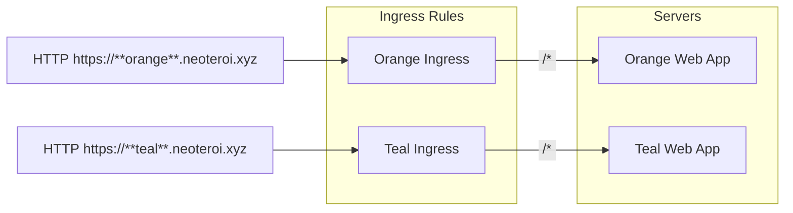
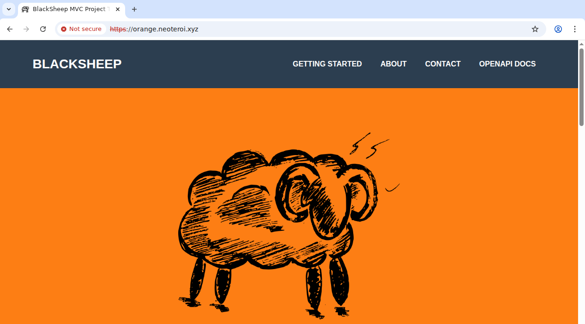
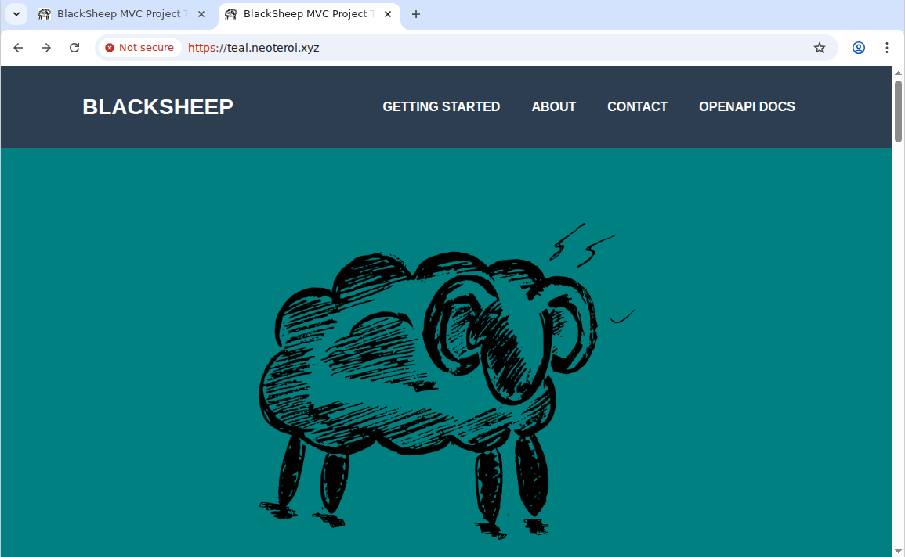

Following my previous exercise to expose many web apps behind a [single domain with
Kind](../kind/web-hosting.md) and [with K3s](./index.md#my-first-exercise), I wanted to try the
alternative scenario where each web app is exposed on its own domain, and ingress rules
are defined for each workload.



The single-domain, path-based routing scenario works well in setups involving central
API Gateways or HTTP Proxies used to expose multiple web APIs or applications. In such
cases, I would use `ExternalName` services to organize the common ingress rules in a
dedicated namespace, while placing each application in its own separate namespace.

The multi-domain scenario is more common when hosting public websites or applications
that need to be accessed directly by users. Each application can have its own domain
name, allowing users to access them without going through a central gateway or proxy. In
this case, there is no need to use _ExternalName_ services and centralized ingress rules
—teams only need to agree on domain names to avoid conflicts. Ingress rules can be
defined within each application's namespace.

## Example

The folder `./examples/08-k3s-multi-domain` contains a working example of the
multi-domain ingress setup, that works well on a default `K3s` installation.

To test locally, clone the repository and follow the instructions below.

### Requirements

Since we are testing locally, set this in your `hosts` file:

```
127.0.0.1  orange.neoteroi.xyz
127.0.0.1  www.orange.neoteroi.xyz
127.0.0.1  teal.neoteroi.xyz
127.0.0.1  www.teal.neoteroi.xyz
```

On Linux, this file is located at `/etc/hosts`.
On Windows, this file is located at `C:\Windows\System32\drivers\etc\hosts`.

### Deploy

From the root of the repository:

```bash
cd examples/08-k3s-multi-domain

cd orange
chmod +x deploy.sh
./deploy.sh

cd ../teal
chmod +x deploy.sh
./deploy.sh
```

The deploy scripts look like this:

```bash
NAMESPACE="orange"

kubectl create namespace $NAMESPACE

cd ssl

# Check if certificate file doesn't exist, generate it
if [ ! -f "$NAMESPACE-neoteroi-xyz-tls.crt" ]; then
  echo "Generating self-signed certificate…"
  chmod +x gen.sh && ./gen.sh
fi

kubectl create secret tls $NAMESPACE-neoteroi-xyz-tls \
  --cert=$NAMESPACE-neoteroi-xyz-tls.crt \
  --key=$NAMESPACE-neoteroi-xyz-tls.key \
  -n $NAMESPACE

cd ../
kubectl apply -f $NAMESPACE.yaml
```

They create a namespace, generate a self-signed TLS certificate (if it doesn't exist
already), create a TLS secret, and apply the deployment and ingress resources.

The deployment files look like this:

```yaml
apiVersion: apps/v1
kind: Deployment
metadata:
  name: orange-app
  namespace: orange
spec:
  replicas: 1
  selector:
    matchLabels:
      app: orange-app
  template:
    metadata:
      labels:
        app: orange-app
    spec:
      tolerations:
        - key: "CriticalAddonsOnly"
          operator: "Exists"
          effect: "NoSchedule"
      containers:
        - name: orange-app
          image: robertoprevato/mvcdemo:latest
          env:
            - name: BG_COLOR
              value: "#fd7e14"
          ports:
            - containerPort: 80
          readinessProbe:
            httpGet:
              path: /
              port: 80
            initialDelaySeconds: 5
            periodSeconds: 10
          livenessProbe:
            httpGet:
              path: /
              port: 80
            initialDelaySeconds: 15
            periodSeconds: 20
---
apiVersion: v1
kind: Service
metadata:
  name: orange-app
  namespace: orange
spec:
  ports:
    - port: 80
      targetPort: 80
  selector:
    app: orange-app
  type: ClusterIP
---
apiVersion: networking.k8s.io/v1
kind: Ingress
metadata:
  name: orange
  namespace: orange
spec:
  ingressClassName: traefik
  tls:
    - hosts:
        - orange.neoteroi.xyz
        - www.orange.neoteroi.xyz
      secretName: orange-neoteroi-xyz-tls
  rules:
    - host: orange.neoteroi.xyz
      http:
        paths:
          - path: /
            pathType: Prefix
            backend:
              service:
                name: orange-app
                port:
                  number: 80
    - host: www.orange.neoteroi.xyz
      http:
        paths:
          - path: /
            pathType: Prefix
            backend:
              service:
                name: orange-app
                port:
                  number: 80
```

This YAML file defines three Kubernetes resources:

1. **Deployment**: Runs a single replica of a web application container with an orange
   background color (`#fd7e14`), including readiness and liveness probes

2. **Service**: Creates a ClusterIP service that exposes the application internally on
   port 80

3. **Ingress**: Configures routing for two domains (`orange.neoteroi.xyz` and
   `www.orange.neoteroi.xyz`) with TLS support using the Traefik ingress controller

The `teal` folder contains a similar setup, but with a different background color
(`#20c997`).

To test the setup, you can use `curl` or a web browser to access the two domains:

```bash
curl -k https://orange.neoteroi.xyz
curl -k https://www.orange.neoteroi.xyz

curl -k https://teal.neoteroi.xyz
curl -k https://www.teal.neoteroi.xyz
```





The positive side of this approach is that each team can manage their own ingress rules
and TLS certificates independently, without needing to coordinate with a central team.
Additionally, each application can handle web requests at the root path (`/`), as not
all applications support being served from a subpath (this is generally not an issue
for web APIs, while it is usually a problem for web applications that include HTML
pages).

## Summary

The multi-domain ingress approach is easy to set up in K3s and can be an excellent way
to host non-production environments on single-node or smaller clusters. Since K3s
supports production workloads, this approach can also be used in larger clusters.
