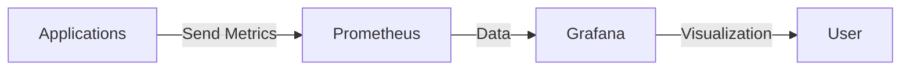
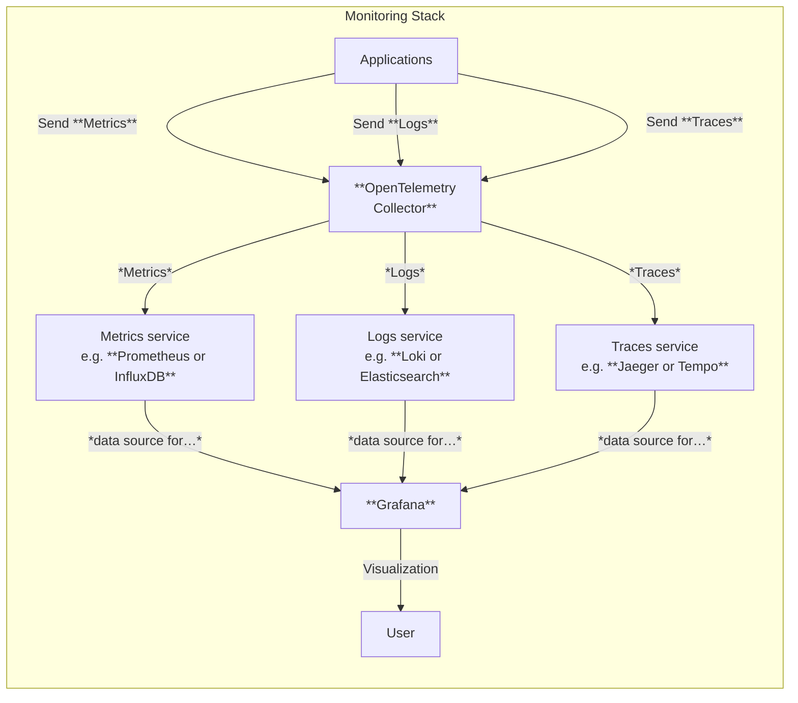

Now I want to make some experience with hosting monitoring infrastructure in Kubernetes.
Since I know Prometheus and Grafana are widely used open source solutions for monitoring,
I started reading about them.

As it often happens, cloud-native systems are distributed using **Helm charts**, and I
will try using these to deploy monitoring. I didn't use **Helm** much so far because I
first wanted to learn the basics of Kubernetes, but now it's time to install it and use
it.

## Introduction to Helm

**Helm** is a package manager for Kubernetes, which simplifies deploying and managing
applications on Kubernetes clusters through the use of "**charts**" - packages of
pre-configured Kubernetes resources.

With Helm, you can:

- Install complex applications with a single command.
- Automatically manage dependencies between components.
- Upgrade applications seamlessly.
- Roll back to previous versions when needed.
- Share application configurations through a repository system.

Helm uses a templating system that makes it easy to customize deployments while
maintaining consistency across environments.

An alternative to Helm is **Kustomize**, which is built into `kubectl` and allows you to
customize Kubernetes configurations without templates. I plan to later learn how to
create Helm charts and use Kustomize as well, but for now, I will focus on using
existing Helm charts to deploy monitoring systems.

### Installing Helm

Like described in the official documentation:

1. Download your desired version.
1. Unpack it (`tar -zxvf helm-v3.0.0-linux-amd64.tar.gz`).
1. Find the helm binary in the unpacked directory, and move it to its desired destination
   (`mv linux-amd64/helm /usr/local/bin/helm`).

*Example, at the time of this writing*:

```bash
cd /tmp/

wget https://get.helm.sh/helm-v3.19.0-linux-amd64.tar.gz

tar -zxvf helm-v3.19.0-linux-amd64.tar.gz

sudo mv linux-amd64/helm /usr/local/bin/helm

# verify installation
helm version
```

And that's it. :sparkles:

## Introduction to Observability

**Observability** is the ability to understand the internal state of a system based on
the data it produces — typically through:

- **Metrics**: Numerical time-series data (e.g., CPU usage, request latency)
- **Logs**: Text records of events (e.g., errors, warnings)
- **Traces**: End-to-end records of requests across services

| Record Type | Description                                                                                                                                                     | Storage Examples                                                                                     |
| ----------- | --------------------------------------------------------------------------------------------------------------------------------------------------------------- | ---------------------------------------------------------------------------------------------------- |
| **Metrics** | Numerical measurements collected at regular intervals. Structured, time-series data (e.g., CPU usage, RAM usage).                                               | [Prometheus](https://prometheus.io/), [InfluxDB](https://www.influxdata.com/)                        |
| **Logs**    | Timestamped records of discrete events. Log entries generated by applications, often collected using log shippers or agents.                                    | [Loki](https://grafana.com/docs/loki/latest/), [Elasticsearch](https://www.elastic.co/elasticsearch) |
| **Traces**  | Records showing request paths through distributed systems. Provide insights into the flow of requests across services, often collected using tracing libraries. | [Jaeger](https://www.jaegertracing.io/), [Tempo](https://grafana.com/docs/tempo/latest/)             |

There are many tools available for collecting, storing, and visualizing each type of
data. For instance, a popular choice for a complete observability stack is the
combination of [**Prometheus**](https://prometheus.io/) for metrics,
[**Loki**](https://grafana.com/docs/loki/latest/) for logs, and
[**Jaeger**](https://www.jaegertracing.io/) for traces, all visualized through
[**Grafana**](https://grafana.com/). But this is just one of many possible combinations
of tools.

A simple overview of how these components can work together in a monitoring setup
**that supports only metrics** is as follows:



In practice, however, modern applications often need to handle not just metrics but also
logs and traces. To simplify the _collection_ of different kinds of records, the
**OpenTelemetry Collector** is commonly used as a central component that can receive,
process, and export all three types of telemetry data, accepting data in the
**OpenTelemetry Protocol (OTLP)** format, which aims to provide a unified way to collect
and transmit telemetry data across different services and platforms, in a
**vendor-agnostic manner**.

A more realistic and complete overview of a modern monitoring setup looks like this:



### Data Flow and Storage

1. **Applications**: These are your services or applications that generate telemetry data
   (metrics, logs, traces). They can be instrumented to send this data to the OpenTelemetry
   Collector.
1. **OpenTelemetry Collector**: This component receives telemetry data from
   applications. It can process, filter, and export this data to various backends for
   storage and querying. It offers a common vendor-agnostic interface (OTLP) for receiving
    telemetry data.
1. **Storage Backends**: These are specialized services that store different types of
   telemetry data: _metrics_, _logs_, and _traces_.
1. **Grafana**: This is the visualization layer that connects to the various storage
   backends. It allows users to create dashboards and panels to visualize and analyze the
   telemetry data.

Each storage backend stores and indexes its respective data type, allowing for efficient
querying and retrieval.

### OpenTelemetry in a Few Words

[**OpenTelemetry**](https://opentelemetry.io/docs/what-is-opentelemetry/) is an
open-source observability framework that provides a set of tools, APIs, and SDKs for
collecting and exporting telemetry data (metrics, logs, traces) from applications and
services. It is a project under the Cloud Native Computing Foundation (CNCF) and is
widely adopted in the cloud-native ecosystem.

## Installing Components

For my exercise, I will install the following components in my Kubernetes cluster:

- **Prometheus**: For collecting and storing metrics.
- **Loki**: For collecting and storing logs.
- **Tempo**: For collecting and storing traces.
- **Grafana**: For visualizing metrics (and later logs and traces).
- **OpenTelemetry Collector**: For the common interface to collect metrics, logs, and
  traces, to make available to applications and to support the OTLP standard interface.

I will configure _Persistent Volumes_ to ensure data durability across pod restarts,
and to

### Installing Prometheus

First add the necessary repository to Helm:

```bash
helm repo add prometheus-community https://prometheus-community.github.io/helm-charts
helm repo update
```

Then install Prometheus using the community Helm chart:

```bash
helm install prometheus prometheus-community/prometheus \
   --namespace monitoring --create-namespace \
   --set server.ingress.enabled=true \
   --set server.ingress.hosts={prometheus.local}
```

In this case, I want to enable ingress to access the Prometheus UI from localhost on the
hostname `prometheus.local`. I also want to deploy Prometheus in the `monitoring`
namespace.

Like done previously for other examples, add an entry to hosts:

```
127.0.0.1 prometheus.local
```

Open [http://prometheus.local](http://prometheus.local) in your browser.

To see what was created, you can run:

```bash
kubectl get all -n monitoring
```

Note that the Prometheus chart by default uses local storage for the Prometheus server,
as visible with `kubectl get pvc -n monitoring`. The PVC folders are created at
`/var/lib/k3s/storage` on the host, since I am using k3s.

### Installing Grafana

The following will install the **Grafana visualization platform**
 in the same `monitoring` namespace, with ingress enabled to access it from outside the cluster:

```bash
helm repo add grafana https://grafana.github.io/helm-charts
helm repo update
```

```bash
helm install grafana grafana/grafana \
  --namespace monitoring --create-namespace \
  --set ingress.enabled=true \
  --set ingress.hosts={grafana.local} \
  --set persistence.enabled=true \
  --set persistence.size=10Gi
```

The output should show instructions to get the admin password and sign-in to Grafana,
like:

```bash
helm install grafana grafana/grafana \
  --namespace monitoring --create-namespace \
  --set ingress.enabled=true \
  --set ingress.hosts={grafana.local} \
  --set persistence.enabled=true \
  --set persistence.size=10Gi
NAME: grafana
LAST DEPLOYED: Thu Sep 18 13:08:00 2025
NAMESPACE: monitoring
STATUS: deployed
REVISION: 1
NOTES:
1. Get your 'admin' user password by running:

   kubectl get secret --namespace monitoring grafana -o jsonpath="{.data.admin-password}" | base64 --decode ; echo


2. The Grafana server can be accessed via port 80 on the following DNS name from within your cluster:

   grafana.monitoring.svc.cluster.local

   If you bind grafana to 80, please update values in values.yaml and reinstall:
   securityContext:
     runAsUser: 0
     runAsGroup: 0
     fsGroup: 0

   command:
   - "setcap"
   - "'cap_net_bind_service=+ep'"
   - "/usr/sbin/grafana-server &&"
   - "sh"
   - "/run.sh"
   Details refer to https://grafana.com/docs/installation/configuration/#http-port.
   Or grafana would always crash.

   From outside the cluster, the server URL(s) are:
     http://grafana.local

3. Login with the password from step 1 and the username: admin
```

Add an entry to hosts:

```
127.0.0.1 grafana.local
```

Then navigate to [http://grafana.local](http://grafana.local) in your browser. It should
display the Grafana login page.

Enter the username `admin` and the password retrieved from the command shown in the
output above.


Once logged in, you can bind Prometheus as a data source. You can obtain the DNS name of
the Prometheus service by running `kubectl get svc -n monitoring` to obtain the name
of `prometheus-server`:

```bash {hl_lines="10"}
kubectl get svc -n monitoring

NAME                                  TYPE        CLUSTER-IP      EXTERNAL-IP   PORT(S)    AGE
grafana                               ClusterIP   10.43.169.186   <none>        80/TCP     18m
prometheus-alertmanager               ClusterIP   10.43.83.222    <none>        9093/TCP   56m
prometheus-alertmanager-headless      ClusterIP   None            <none>        9093/TCP   56m
prometheus-kube-state-metrics         ClusterIP   10.43.71.6      <none>        8080/TCP   56m
prometheus-prometheus-node-exporter   ClusterIP   10.43.90.133    <none>        9100/TCP   56m
prometheus-prometheus-pushgateway     ClusterIP   10.43.178.124   <none>        9091/TCP   56m
prometheus-server                     ClusterIP   10.43.248.242   <none>        80/TCP     56m
```

And using the DNS name `prometheus-server.monitoring.svc.cluster.local` as the URL
when adding a new data source in Grafana (`<service-name>.<namespace>.svc.cluster.local`).

### Installing Loki

There are a few ways to install Loki. Since I am currently interested in hosting local
environments using filesystem storage, I am selecting the Helm **monolithic** chart
method, like documented at [_Install the monolithic Helm chart_](https://grafana.com/docs/loki/latest/setup/install/helm/install-monolithic/).

```bash
helm show values grafana/loki-stack > loki-default-values.yaml
```

```bash
# Install Loki Stack
helm install  --values loki-values.yaml \
  loki grafana/loki-stack \
  --namespace monitoring
```

The `grafana.enabled=false` parameter prevents the Loki chart from installing a duplicate
Grafana instance since you already have one.

Go back to Grafana, and add Loki as a data source, using the URL:
`http://loki.monitoring.svc.cluster.local:3100`.

### Testing a Python application

OK, now I have a working Grafana and Prometheus installation on my Kubernetes cluster.
How can I send the logs from a Python application using the OTLP standard, using env
variables like `OTEL_EXPORTER_OTLP_ENDPOINT` and related?

## TODO: correct this text

## OpenTelemetry Collector in Kubernetes Monitoring Setup

The OpenTelemetry Collector is a separate component that should be deployed to your
Kubernetes cluster alongside Prometheus and Grafana - not as part of either of them.

## What is the OpenTelemetry Collector?

The OpenTelemetry Collector acts as a middleware component that:

1. Receives telemetry data (metrics, logs, traces) from your applications
2. Processes that data (filtering, transforming, batching)
3. Exports the data to your observability backends

## Architecture Overview

In your monitoring setup, the components work together like this:

```
Python App (OTLP) → OpenTelemetry Collector → Prometheus → Grafana
```

## Deploying the OpenTelemetry Collector

Let's start by adding the OpenTelemetry Helm repository:

```bash
# Add OpenTelemetry Helm repository
helm repo add open-telemetry https://open-telemetry.github.io/opentelemetry-helm-charts
helm repo update
```

Before deploying a collector, we need to create a configuration file. This file defines
how the collector receives data, processes it, and exports it to Prometheus. This can be
challenging because the OTEL Collector configuration offers many options, and many
examples on the web are outdated. GitHub Copilot is helpful, but not perfect because of
outdated examples on the internet.

To investigate the current options, you can use the following command to obtain the
default values for the Helm chart:

```bash
helm show values open-telemetry/opentelemetry-collector > otel-default-values.yaml
```

And read the documented YAML. The `./examples/08-monitoring/otel-collector-values.yaml`
file in this repository contains a working example.

You can deploy the collector using Helm:

```bash
# Add OpenTelemetry Helm repository
helm repo add open-telemetry https://open-telemetry.github.io/opentelemetry-helm-charts
helm repo update

# Install the collector in the same namespace as your Prometheus and Grafana
helm install opentelemetry-collector open-telemetry/opentelemetry-collector \
  --namespace monitoring \
  --values otel-collector-values.yaml
```

You'll need to configure Prometheus to scrape metrics from this endpoint. With your
existing Prometheus deployment, you can add a ServiceMonitor or update the Prometheus
configuration to include the OpenTelemetry Collector endpoint.

The collector should be deployed in the same namespace as your other monitoring
components (monitoring) for simplicity, though it can work across namespaces with proper
configuration.
