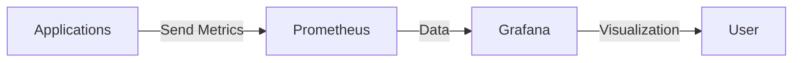
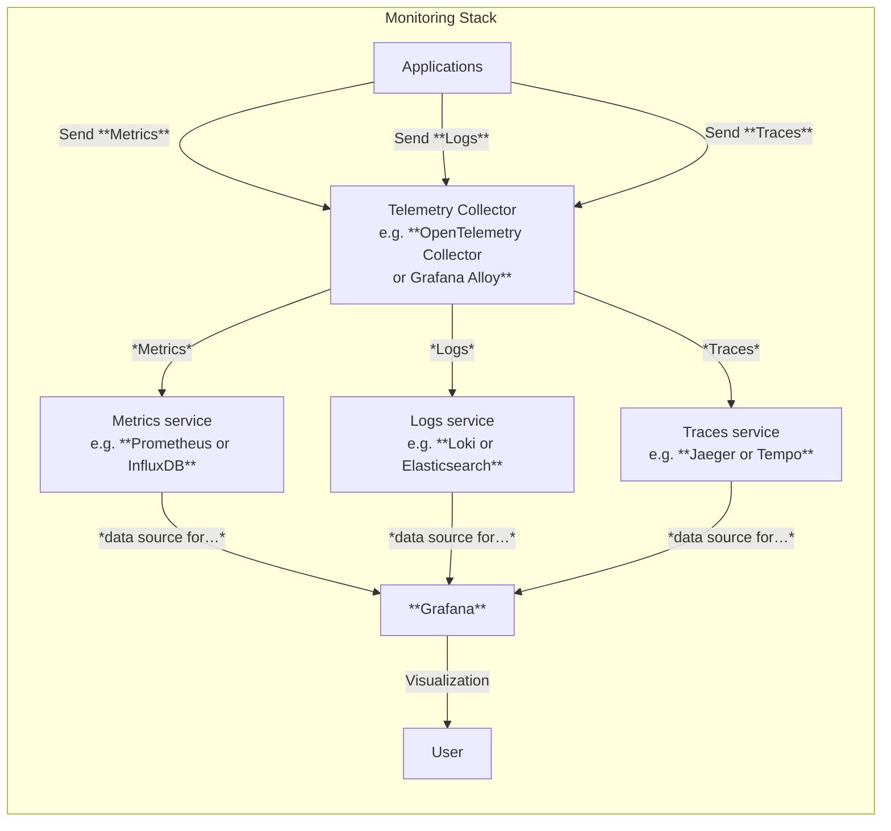

In this article and related examples, I provide a working solution for deploying a
**complete monitoring stack** in a single node of a Kubernetes cluster, intended for
**non-production** environments. Logs and metrics are stored on the local file system of
the node. Although this setup is not suitable for production, it serves as a valuable
exercise for learning how to deploy and configure these components. It can be useful for
local development and testing, and it provides foundational knowledge for working with
distributed and production environments.

Follow this article using the files in the `./examples/09-monitoring` folder of this
repository.

The end result is a system that can collect and visualize informations like in
the following pictures:


As it often happens, cloud-native systems are distributed using **Helm charts**, and I
will try using these to deploy monitoring. I didn't use **Helm** much so far because I
first wanted to learn the basics of Kubernetes, but now it's time to install it and use
it.

## Introduction to Helm

**Helm** is a package manager for Kubernetes, which simplifies deploying and managing
applications on Kubernetes clusters through the use of "**charts**" - packages of
pre-configured Kubernetes resources.

With Helm, you can:

- Install complex applications with a single command.
- Automatically manage dependencies between components.
- Upgrade applications seamlessly.
- Roll back to previous versions when needed.
- Share application configurations through a repository system.

Helm uses a templating system that makes it easy to customize deployments while
maintaining consistency across environments.

An alternative to Helm is **Kustomize**, which is built into `kubectl` and allows you to
customize Kubernetes configurations without templates. I plan to later learn how to
create Helm charts and use Kustomize as well, but for now, I will focus on using
existing Helm charts to deploy monitoring systems.

### Installing Helm

Like described in the official documentation:

1. Download your desired version.
1. Unpack it (`tar -zxvf helm-v3.0.0-linux-amd64.tar.gz`).
1. Find the helm binary in the unpacked directory, and move it to its desired destination
   (`mv linux-amd64/helm /usr/local/bin/helm`).

*Example, at the time of this writing*:

```bash
cd /tmp/

wget https://get.helm.sh/helm-v3.19.0-linux-amd64.tar.gz

tar -zxvf helm-v3.19.0-linux-amd64.tar.gz

sudo mv linux-amd64/helm /usr/local/bin/helm

# verify installation
helm version
```

And that's it. :sparkles:

## Introduction to Observability

**Observability** is the ability to understand the internal state of a system based on
the data it produces — typically through:

- **Metrics**: Numerical time-series data (e.g., CPU usage, request latency)
- **Logs**: Text records of events (e.g., errors, warnings)
- **Traces**: End-to-end records of requests across services

| Record Type | Description                                                                                                                                                     | Storage Examples                                                                                     |
| ----------- | --------------------------------------------------------------------------------------------------------------------------------------------------------------- | ---------------------------------------------------------------------------------------------------- |
| **Metrics** | Numerical measurements collected at regular intervals. Structured, time-series data (e.g., CPU usage, RAM usage).                                               | [Prometheus](https://prometheus.io/), [InfluxDB](https://www.influxdata.com/)                        |
| **Logs**    | Timestamped records of discrete events. Log entries generated by applications, often collected using log shippers or agents.                                    | [Loki](https://grafana.com/docs/loki/latest/), [Elasticsearch](https://www.elastic.co/elasticsearch) |
| **Traces**  | Records showing request paths through distributed systems. Provide insights into the flow of requests across services, often collected using tracing libraries. | [Jaeger](https://www.jaegertracing.io/), [Tempo](https://grafana.com/docs/tempo/latest/)             |

There are many tools available for collecting, storing, and visualizing each type of
data. For instance, a popular choice for a complete observability stack is the
combination of [**Prometheus**](https://prometheus.io/) for metrics,
[**Loki**](https://grafana.com/docs/loki/latest/) for logs, and
[**Jaeger**](https://www.jaegertracing.io/) for traces, all visualized through
[**Grafana**](https://grafana.com/). But this is just one of many possible combinations
of tools.

A simple overview of how these components can work together in a monitoring setup
**that supports only metrics** is as follows:



In practice, however, applications need to handle not just metrics but also
logs and traces. To simplify the _collection_ of different kinds of records, a
**Telemetry Collector** component is used as a central component that can receive,
process, and export all three types of telemetry data.

A more realistic and complete overview of a modern monitoring setup looks like this:



### Data Flow and Storage

1. **Applications**: These are your services or applications that generate telemetry data
   (metrics, logs, traces). They can be instrumented to send this data to the OpenTelemetry
   Collector.
1. **OpenTelemetry Collector**: This component receives telemetry data from
   applications. It can process, filter, and export this data to various backends for
   storage and querying. It offers a common vendor-agnostic interface (OTLP) for receiving
    telemetry data.
1. **Storage Backends**: These are specialized services that store different types of
   telemetry data: _metrics_, _logs_, and _traces_.
1. **Grafana**: This is the visualization layer that connects to the various storage
   backends. It allows users to create dashboards and panels to visualize and analyze the
   telemetry data.

Each storage backend stores and indexes its respective data type, allowing for efficient
querying and retrieval.

### OpenTelemetry in a Few Words

**OpenTelemetry** was "born" in May 2019 when the two leading open-source observability
projects, **OpenTracing** and **OpenCensus**, merged to form a single, unified standard.
This merger was driven by the desire to standardize the collection of telemetry data
(traces, metrics, and logs) and eliminate vendor lock-in, ultimately creating a
vendor-neutral framework for collecting and exporting observability data.

Today [**OpenTelemetry**](https://opentelemetry.io/docs/what-is-opentelemetry/) is an
open-source observability framework that provides a set of tools, APIs, and SDKs for
collecting and exporting telemetry data (metrics, logs, traces) from applications and
services. It is a project under the Cloud Native Computing Foundation (CNCF) and is
widely adopted in the cloud-native ecosystem.

## Installing Components

For my exercise, I will install the following components in my Kubernetes cluster:

- **Prometheus**: For collecting and storing metrics.
- **Grafana Loki**: For collecting and storing logs.
- **Grafana Tempo**: For collecting and storing traces.
- **Grafana**: For visualizing metrics, logs, and traces.
- **OpenTelemetry Collector**: For the telemetry collector offering a common interface to
  collect metrics, logs, and traces, and supporting the OTLP standard interface.

I will configure _Persistent Volumes_ to ensure data durability across pod
restarts.


/// details | Grafana alternative to OpenTelemetry Collector.
    type: example

**Grafana** offers a component that can be used as alternative to the OpenTelemetry Collector:
**Grafana Alloy**.

---

**Grafana Alloy** is an open-source, vendor-neutral **telemetry collector**
developed by Grafana Labs. It is designed to collect, process, and forward
logs, metrics, and traces from your infrastructure to various backends,
including Grafana Cloud, Prometheus, Loki, Tempo, and others.

**Similarities to OpenTelemetry Collector:**

- Both are **telemetry collectors** that can receive, process, and export
  observability data (metrics, logs, traces).
- Both support **pipelines** for transforming and routing data.
- Both are extensible and support multiple protocols and backends.
- **Grafana Alloy supports OTLP** (OpenTelemetry Protocol) for both metrics and
  traces. Alloy can receive OTLP data over gRPC and HTTP, making it compatible
  with OpenTelemetry SDKs and agents.


**Differences:**

- **Alloy** is built by Grafana Labs and is designed to work seamlessly with
  the Grafana stack (Prometheus, Loki, Tempo, etc.), but is also
  vendor-neutral.
- **OpenTelemetry Collector** is a CNCF project and is the reference
  implementation for the OpenTelemetry standard, aiming for broad
  interoperability across vendors and formats.
- Alloy has a configuration and extension model inspired by Prometheus Agent
  and supports Prometheus scraping natively.

**Summary:**

Grafana Alloy and OpenTelemetry Collector serve similar purposes, but Alloy is
more tightly integrated with the Grafana ecosystem, while OpenTelemetry
Collector is more general-purpose and standards-focused.

///

### Installing Prometheus

First add the necessary repository to Helm:

```bash
helm repo add prometheus-community https://prometheus-community.github.io/helm-charts
helm repo update
```

Then install Prometheus using the community Helm chart:

```bash
helm install prometheus prometheus-community/prometheus \
   --namespace monitoring --create-namespace \
   --set server.ingress.enabled=true \
   --set server.ingress.hosts={prometheus.local}
```

In this case, I want to enable ingress to access the Prometheus UI from localhost on the
hostname `prometheus.local`. I also want to deploy Prometheus in the `monitoring`
namespace.

Like done previously for other examples, add an entry to hosts:

```
127.0.0.1 prometheus.local
```

Open [http://prometheus.local](http://prometheus.local) in your browser.

To see what was created, you can run:

```bash
kubectl get all -n monitoring
```

Note that the Prometheus chart by default uses local storage for the Prometheus server,
as visible with `kubectl get pvc -n monitoring`. The PVC folders are created at
`/var/lib/k3s/storage` on the host, since I am using k3s.

### Installing Grafana

The following will install the **Grafana visualization platform** in the same
 `monitoring` namespace, with ingress enabled to access it from outside the cluster:

```bash
helm repo add grafana https://grafana.github.io/helm-charts
helm repo update
```

```bash
helm install grafana grafana/grafana \
  --namespace monitoring --create-namespace \
  --set ingress.enabled=true \
  --set ingress.hosts={grafana.local} \
  --set persistence.enabled=true \
  --set persistence.size=10Gi
```

The output should show instructions to get the admin password and sign-in to Grafana,
like:

```bash
helm install grafana grafana/grafana \
  --namespace monitoring --create-namespace \
  --set ingress.enabled=true \
  --set ingress.hosts={grafana.local} \
  --set persistence.enabled=true \
  --set persistence.size=10Gi
NAME: grafana
LAST DEPLOYED: Thu Sep 18 13:08:00 2025
NAMESPACE: monitoring
STATUS: deployed
REVISION: 1
NOTES:
1. Get your 'admin' user password by running:

   kubectl get secret --namespace monitoring grafana -o jsonpath="{.data.admin-password}" | base64 --decode ; echo


2. The Grafana server can be accessed via port 80 on the following DNS name from within your cluster:

   grafana.monitoring.svc.cluster.local

   If you bind grafana to 80, please update values in values.yaml and reinstall:
   securityContext:
     runAsUser: 0
     runAsGroup: 0
     fsGroup: 0

   command:
   - "setcap"
   - "'cap_net_bind_service=+ep'"
   - "/usr/sbin/grafana-server &&"
   - "sh"
   - "/run.sh"
   Details refer to https://grafana.com/docs/installation/configuration/#http-port.
   Or grafana would always crash.

   From outside the cluster, the server URL(s) are:
     http://grafana.local

3. Login with the password from step 1 and the username: admin
```

Add an entry to hosts:

```
127.0.0.1 grafana.local
```

Then navigate to [http://grafana.local](http://grafana.local) in your browser. It should
display the Grafana login page.

Enter the username `admin` and the password retrieved from the command shown in the
output above.


At this point, Grafana is not so interesting because it has no data source configured.

Once logged in, you can bind **Prometheus** as a data source. You can obtain the DNS
name of the Prometheus service by running `kubectl get svc -n monitoring` to see which services were deployed by the Helm chart.
In this case, we are interested in `prometheus-server`:

```bash {hl_lines="10"}
kubectl get svc -n monitoring

NAME                                  TYPE        CLUSTER-IP      EXTERNAL-IP   PORT(S)    AGE
grafana                               ClusterIP   10.43.169.186   <none>        80/TCP     18m
prometheus-alertmanager               ClusterIP   10.43.83.222    <none>        9093/TCP   56m
prometheus-alertmanager-headless      ClusterIP   None            <none>        9093/TCP   56m
prometheus-kube-state-metrics         ClusterIP   10.43.71.6      <none>        8080/TCP   56m
prometheus-prometheus-node-exporter   ClusterIP   10.43.90.133    <none>        9100/TCP   56m
prometheus-prometheus-pushgateway     ClusterIP   10.43.178.124   <none>        9091/TCP   56m
prometheus-server                     ClusterIP   10.43.248.242   <none>        80/TCP     56m
```

We must use the DNS name `prometheus-server.monitoring.svc.cluster.local` as the URL
when adding a new data source in Grafana (`<service-name>.<namespace>.svc.cluster.local`).

### Installing Loki

There are a few ways to install **Loki**. Since I am currently interested in hosting
local environments using filesystem storage, I am interested in a chart that deploys
Loki to a single node.

/// admonition | Outdated documentation.
    type: danger

Initially I followed the documentation at: [_Install the monolithic Helm chart_](https://grafana.com/docs/loki/latest/setup/install/helm/install-monolithic/), but this documentation is
outdated as it suggests using a chart named `loki-stack`, which is deprecated
and not working anymore like documented. I lost hours trying to make this work,
and finally had success using the `loki` chart.

The article by [Aswin Vijayan, How to Setup Grafana Loki on Kubernetes & Query Logs](https://devopscube.com/setup-grafana-loki/) was helpful. :smile:

///

The `./examples/09-monitoring` folder contains an example that works (at this time)
to install Grafana Loki on a Kubernetes cluster. This file is configured to
use Loki using the `SingleBinary` mode and store files on the node's file system
using the `local-path` provider.

```bash
helm install loki grafana/loki -n monitoring --create-namespace -f loki-values.yaml
```

The command should display an output like the following:

```
NAME: loki
LAST DEPLOYED: Sun Sep 21 17:08:30 2025
NAMESPACE: monitoring
STATUS: deployed
REVISION: 1
NOTES:
***********************************************************************
 Welcome to Grafana Loki
 Chart version: 6.40.0
 Chart Name: loki
 Loki version: 3.5.3
***********************************************************************

** Please be patient while the chart is being deployed **

Tip:

  Watch the deployment status using the command: kubectl get pods -w --namespace monitoring

If pods are taking too long to schedule make sure pod affinity can be fulfilled in the current cluster.

***********************************************************************
Installed components:
***********************************************************************
* loki

Loki has been deployed as a single binary.
This means a single pod is handling reads and writes. You can scale that pod vertically by adding more CPU and memory resources.


***********************************************************************
Sending logs to Loki
***********************************************************************

Loki has been configured with a gateway (nginx) to support reads and writes from a single component.

You can send logs from inside the cluster using the cluster DNS:

http://loki-gateway.monitoring.svc.cluster.local/loki/api/v1/push

You can test to send data from outside the cluster by port-forwarding the gateway to your local machine:

  kubectl port-forward --namespace monitoring svc/loki-gateway 3100:80 &

And then using http://127.0.0.1:3100/loki/api/v1/push URL as shown below:

curl -H "Content-Type: application/json" -XPOST -s "http://127.0.0.1:3100/loki/api/v1/push"  \
--data-raw "{\"streams\": [{\"stream\": {\"job\": \"test\"}, \"values\": [[\"$(date +%s)000000000\", \"fizzbuzz\"]]}]}"

Then verify that Loki did receive the data using the following command:

curl "http://127.0.0.1:3100/loki/api/v1/query_range" --data-urlencode 'query={job="test"}' | jq .data.result

***********************************************************************
Connecting Grafana to Loki
***********************************************************************

If Grafana operates within the cluster, you'll set up a new Loki datasource by utilizing the following URL:

http://loki-gateway.monitoring.svc.cluster.local/
```

Go back to Grafana, and add Loki as a data source, using the URL:
`http://loki-gateway.monitoring.svc.cluster.local/` - this can require waiting
for a few minutes.

To test sending data to Loki, you can do it following the instructions of the
Loki installer:

```bash
# in one terminal…
kubectl port-forward --namespace monitoring svc/loki-gateway 3100:80

# in another terminal…
curl -H "Content-Type: application/json" -XPOST -s "http://127.0.0.1:3100/loki/api/v1/push"  --data-raw "{\"streams\": [{\"stream\": {\"job\": \"test\"}, \"values\": [[\"$(date +%s)000000000\", \"fizzbuzz\"]]}]}"
```

Logs are visible in the Grafana UI, like in the following picture:


More logs are visible, such as:

```
2025-09-21 17:22:55.633
1758468175633109694 ppppppppppppppppppppppppppppppppppppppppppppppppppppppppppppppppppppppppppppppp
```

These are **test log entries** generated by the Loki Helm chart’s installation
instructions or by manual test commands.

### Installing Tempo

To support _traces_, I want to install a service that can handle them. Since I am using Grafana for other components, I opt for **Grafana Tempo**.

[Documentation :scroll:](https://grafana.com/docs/helm-charts/tempo-distributed/next/get-started-helm-charts/).

To see the default values of the chart:

```bash
helm show values grafana/tempo > tempo-default-values.yaml
```

In this case, I create first PVCs and then deploy tempo to persist data on the
local file system.

```bash
kubectl apply -f tempo-pvc.yaml -n monitoring

helm install tempo grafana/tempo -n monitoring --create-namespace -f tempo-values.yaml
```

Go back to Grafana and add a **Tempo** data source using the URL:
`http://tempo.monitoring.svc.cluster.local:3200/`.


For now I don't try sending data to it, as I want to later have a Telemetry Collector send traces to Tempo.

### Testing a Python application

OK, now I have a working Grafana and Prometheus installation on my Kubernetes cluster.
How can I send the logs from a Python application using the OTLP standard, using env
variables like `OTEL_EXPORTER_OTLP_ENDPOINT` and related?

## OpenTelemetry Collector in Kubernetes Monitoring Setup

The OpenTelemetry Collector is a separate component that should be deployed to your
Kubernetes cluster alongside Prometheus and Grafana - not as part of either of them.

## What is the OpenTelemetry Collector?

The OpenTelemetry Collector acts as a middleware component that:

1. Receives telemetry data (metrics, logs, traces) from your applications
2. Processes that data (filtering, transforming, batching)
3. Exports the data to your observability backends

## Deploying the OpenTelemetry Collector

Let's start by adding the OpenTelemetry Helm repository:

```bash
# Add OpenTelemetry Helm repository
helm repo add open-telemetry https://open-telemetry.github.io/opentelemetry-helm-charts
helm repo update
```

Before deploying a collector, we need to create a configuration file. This file defines
how the collector receives data, processes it, and exports it to Prometheus. This can be
challenging because the OTEL Collector configuration offers many options, and many
examples on the web are outdated. GitHub Copilot is helpful, but not perfect because of
outdated examples on the internet.

To investigate the current options, you can use the following command to obtain the
default values for the Helm chart:

```bash
helm show values open-telemetry/opentelemetry-collector > otel-default-values.yaml
```

And read the documented YAML. The `./examples/09-monitoring/otel-collector-values.yaml`
file in this repository contains a working example.

You can deploy the collector using Helm:

```bash
helm install opentelemetry-collector open-telemetry/opentelemetry-collector \
  --namespace monitoring \
  --values otel-collector-values.yaml
```

You'll need to configure Prometheus to scrape metrics from this endpoint. With your
existing Prometheus deployment, you can add a ServiceMonitor or update the Prometheus
configuration to include the OpenTelemetry Collector endpoint.

The collector should be deployed in the same namespace as your other monitoring
components (monitoring) for simplicity, though it can work across namespaces with proper
configuration.
