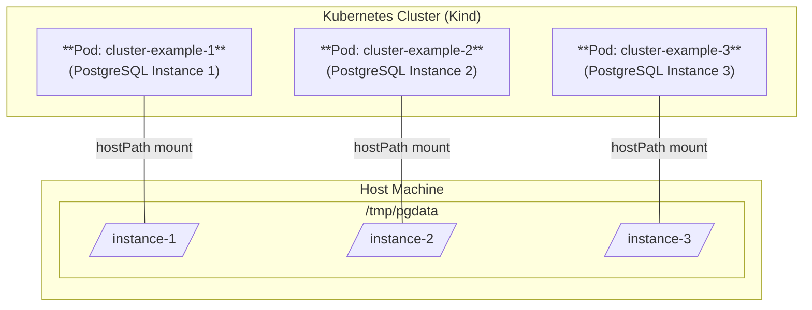

In this exercise, I wanted to learn more about running PostgreSQL in Kubernetes,
for production. I decided to study and practice with [**CloudNativePG (CNPG)**](https://cloudnative-pg.io/),
which is a _Kubernetes Operator_ to manage PostgreSQL.

[_Operators_](https://kubernetes.io/docs/concepts/extend-kubernetes/operator/)
are a way to extend Kubernetes capabilities to manage complex applications,
like databases, by automating tasks such as deployment, scaling, and automatic
failovers in case of node failure.

## Why so much interest in PostgreSQL?

Started in 1986, PostgreSQL is a powerful, open-source object-relational
database system, and one of the most successful and popular open-source
projects ever. [PostgreSQL ranked #1](https://survey.stackoverflow.co/2023/#section-most-popular-technologies-databases).
in a 2023 Stack Overflow survey about the most popular technologies, in the
databases category. It is known for its reliability, feature robustness,
and performance, and it is widely used in production systems.

I used PostgreSQL several times in the past, and I know it to be a great choice.

## CloudNativePG quickstart

Since I like to get the first impressions by practicing, I jumped into
the [CloudNativePG documentation](https://cloudnative-pg.io/documentation/current/)
and after reading a bit of introduction, I immediately headed to the
[_Quickstart_](https://cloudnative-pg.io/documentation/current/quickstart/)
section, which includes instructions to try CNPG in Kind.
The first impressions are great!

/// note | Level 5 Kubernetes Operator.

CloudNativePG is a Level 5 Kubernetes Operator (_Auto Pilot_), which means it
provides full lifecycle management of the _operand_ -in this case, PostgreSQL
clusters. It automates tasks such as deployment, scaling, and automatic
failovers in case of node failure.

///


Create a cluster with Kind, and configure `kubectl` to use it:

```bash
kind create cluster --name pg

kubectl cluster-info --context kind-pg
```

Install the [CloudNativePG operator](https://cloudnative-pg.io/documentation/current/installation_upgrade/):

```bash
kubectl apply --server-side -f \
  https://raw.githubusercontent.com/cloudnative-pg/cloudnative-pg/release-1.26/releases/cnpg-1.26.1.yaml
```

Check for the status:

```bash
kubectl rollout status deployment -n cnpg-system cnpg-controller-manager
```

The output should say: _deployment "cnpg-controller-manager" successfully rolled out_.

### Create a CloudNativePG cluster

Now, create a PostgreSQL cluster, using the example manifest of the
documentation, like in `./examples/06-cloudnativepg/`:

```yaml
apiVersion: postgresql.cnpg.io/v1
kind: Cluster
metadata:
  name: cluster-example
spec:
  instances: 3

  storage:
    size: 1Gi
```

```bash
# ./examples/06-cloudnativepg/
kubectl apply -f cluster-example-01.yaml
```

Now, if you list the services with `kubectl get svc`, you should see three
services created:

```bash {hl_lines="1 4-6"}
$ kubectl get svc

NAME                 TYPE        CLUSTER-IP      EXTERNAL-IP   PORT(S)    AGE
cluster-example-r    ClusterIP   10.96.217.220   <none>        5432/TCP   6s
cluster-example-ro   ClusterIP   10.96.18.205    <none>        5432/TCP   6s
cluster-example-rw   ClusterIP   10.96.107.144   <none>        5432/TCP   6s
kubernetes           ClusterIP   10.96.0.1       <none>        443/TCP    6m56s
```

These services are documented in the [_Service Management_](https://cloudnative-pg.io/documentation/current/service_management/#service-management)
section of the CloudNativePG documentation.

- The `cluster-example-rw` points to the primary instance of the cluster
  (read/write). This is necessary for replication.
- The `cluster-example-ro` points to the replicas, where available (read-only).
- The `cluster-example-r` points to any PostgreSQL instance in the cluster (read).

---

### Connect to the CloudNativePG cluster

The [CloudNativePG's _QuickStart_ documentation here](https://cloudnative-pg.io/documentation/current/quickstart/)
becomes dispersive, as it forgets to describe how to connect to the database,
and it jumps to the subject of how to _Monitor clusters with Prometheus and Grafana_.

For information on how to connect to the database, you need to move to another page:
[_Connecting from an application_](https://cloudnative-pg.io/documentation/1.26/applications/).

By default, CloudNativePG creates a PostgreSQL user named `app` with limited
access (e.g., it cannot create new databases) and a single database named `app`.
The password for this user is stored in a Kubernetes secret named `<cluster-name>-app`.

To test a connection to the database server:

- use `kubectl port-forward` to forward the service port to your local machine
- obtain the password for the `app` user from the Kubernetes secret
- connect using `psql` or any other PostgreSQL client

```bash
kubectl port-forward svc/cluster-example-rw 5432:5432

# Get the password for the app user
PGPASSWORD=$(kubectl get secret cluster-example-app -o jsonpath="{.data.password}" | base64 -d)
```

Then, let's use `psql` to connect to the database. Here I use `psql` installed
in the `host`, like [documented here](./postgresql.md#connect-using-psql):

```bash
PGPASSWORD=$PGPASSWORD psql -h localhost -p 5432 -U app app
```

If the connection is successful, you should see the `psql` prompt:

```
psql (17.5 (Ubuntu 17.5-1.pgdg24.04+1))
SSL connection (protocol: TLSv1.3, cipher: TLS_AES_256_GCM_SHA384, compression: off, ALPN: postgresql)
Type "help" for help.

app=>
```

Just to practice, let's create a table and insert some data:

```sql
CREATE TABLE cookie (
    id SERIAL PRIMARY KEY,
    text TEXT NOT NULL
);

INSERT INTO cookie (text) VALUES ('You will eat more cookies today.');

INSERT INTO cookie (text) VALUES ('Sleep more.');

SELECT * FROM cookie;
```

We can also verify that the user `app` cannot create new databases:

```sql
CREATE DATABASE testdb;
```

This should fail with the error: `ERROR:  permission denied to create database`.

To exit `psql`, type `\q`. The port-forwarding seems to be closed when you exit
`psql`, so you need to run it again if you want to connect again.

### Enable the super user

To enable the super user (one that we can use to connect and create new databases),
we need to add the `enableSuperuserAccess: true` line to the cluster manifest:

```yaml {hl_lines="8"}
apiVersion: postgresql.cnpg.io/v1
kind: Cluster
metadata:
  name: cluster-example
spec:
  instances: 3

  enableSuperuserAccess: true  # enable super use postgres
```

And repeat a deployment:

```bash
kubectl apply -f cluster-example-01.yaml
```

If you list the secrets now, you should see a new secret named `*-superuser`:

```bash
$ kubectl get secret
NAME                          TYPE                       DATA   AGE
cluster-example-app           kubernetes.io/basic-auth   11     24m
cluster-example-ca            Opaque                     2      24m
cluster-example-replication   kubernetes.io/tls          2      24m
cluster-example-server        kubernetes.io/tls          2      24m
cluster-example-superuser     kubernetes.io/basic-auth   11     22s
```

To connect to the database using the super user;

```bash
kubectl port-forward svc/cluster-example-rw 5432:5432
```

```bash
# Get the password for the app user
PGPASSWORD=$(kubectl get secret cluster-example-superuser -o jsonpath="{.data.password}" | base64 -d)

PGPASSWORD=$PGPASSWORD psql -h localhost -p 5432 -U postgres postgres
```

Which should open a `psql` session as the super user:

```
psql (17.5 (Ubuntu 17.5-1.pgdg24.04+1))
SSL connection (protocol: TLSv1.3, cipher: TLS_AES_256_GCM_SHA384, compression: off, ALPN: postgresql)
Type "help" for help.

postgres=#
```

Try creating a new database:

```sql
CREATE DATABASE testdb;
```

Then list DBs with `\l`, and connect to the new database with `\c testdb`.

```bash
postgres=# CREATE DATABASE testdb;
CREATE DATABASE
postgres=# \l
                                                List of databases
   Name    |  Owner   | Encoding | Locale Provider | Collate | Ctype | Locale | ICU Rules |   Access privileges
-----------+----------+----------+-----------------+---------+-------+--------+-----------+-----------------------
 app       | app      | UTF8     | libc            | C       | C     |        |           |
 postgres  | postgres | UTF8     | libc            | C       | C     |        |           |
 template0 | postgres | UTF8     | libc            | C       | C     |        |           | =c/postgres          +
           |          |          |                 |         |       |        |           | postgres=CTc/postgres
 template1 | postgres | UTF8     | libc            | C       | C     |        |           | =c/postgres          +
           |          |          |                 |         |       |        |           | postgres=CTc/postgres
 testdb    | postgres | UTF8     | libc            | C       | C     |        |           |
(5 rows)

postgres=# \c testdb
SSL connection (protocol: TLSv1.3, cipher: TLS_AES_256_GCM_SHA384, compression: off, ALPN: postgresql)
You are now connected to database "testdb" as user "postgres".
testdb=#
```

---

## Reading time…

The first impressions are great! So positive, that I decided to read the whole
documentation before continuing with practicing.
I also watched the talk given by Chris Milsted and Gabriele Bartolini at
KubeCon NA 2022 entitled ["Data On Kubernetes, Deploying And Running PostgreSQL And Patterns For Databases In a Kubernetes Cluster"](https://www.youtube.com/watch?v=99uSJXkKpeI&ab_channel=CNCF%5BCloudNativeComputingFoundation%5D).

The talk covers several important topics, including architectures like the one
illustrated below, which shows a cross-cluster replication setup with
CloudNativePG, where the primary cluster is in one Kubernetes cluster and the
replica cluster is in another Kubernetes cluster, with the replication
happening over the internet.


Recommended reading:

- [_Recommended architectures for PostgreSQL in Kubernetes_](https://www.cncf.io/blog/2023/09/29/recommended-architectures-for-postgresql-in-kubernetes/).

---

## Share storage for local development

For **local development**, I wanted to share and persist the storage of the
PostgreSQL cluster on the host. The diagram below illustrates the scenario,
where each PostgreSQL instance in the cluster has its own `pgdata` folder
mounted from the host machine, using `hostPath` volumes.



Create the folders on the host:

```bash
mkdir -p /tmp/pgdata/instance-{1,2,3}

# make the directories writable
chmod -R 777 /tmp/pgdata
```

/// details | Folder permissions.

PostgreSQL (and thus CloudNativePG) requires that the data directory is
writable by the PostgreSQL user inside the container (usually UID 26 or 999,
depending on the image). If the permissions are too restrictive, the pods will
fail to start with a "permission denied" error.

To ensure pgdata and its subdirectories are usable, set the permissions so that
all users can read/write (for local development only).

///

Create a Kind cluster using the `kind.yaml` configuration file
in `./examples/06-cloudnativepg/`, which includes a mount to the host:

```yaml
kind: Cluster
apiVersion: kind.x-k8s.io/v1alpha4
nodes:
  - role: control-plane
    extraMounts:
      - hostPath: /tmp/pgdata
        containerPath: /pgdata
```

Create a cluster with the configuration file:

```bash
kind create cluster --config kind.yaml --name db

kubectl cluster-info --context kind-db
```

Install the CloudNativePG operator, like earlier, and apply the third example
cluster manifest:

```bash
kubectl apply --server-side -f \
  https://raw.githubusercontent.com/cloudnative-pg/cloudnative-pg/release-1.26/releases/cnpg-1.26.1.yaml

kubectl rollout status deployment -n cnpg-system cnpg-controller-manager

# ./examples/06-cloudnativepg/
kubectl apply -f cluster-example-03.yaml
```

Verify the status of the deployment:

```bash
watch kubectl get pods
```

After a few seconds, you should see three pods running, like:

```bash
NAME                READY   STATUS    RESTARTS   AGE
cluster-example-1   1/1     Running   0          103s
cluster-example-2   1/1     Running   0          83s
cluster-example-3   1/1     Running   0          64s
```

You can try connecting to the database using `psql`, like before.

/// danger | Only for development!

This makes sense only for **local development**. In production or more important
environments, it's not good to have a single point of failure in a single disk,
and `hostPath` is not a good option.

///

## Including a Load Balancer

To include a Load Balancer, do like documented at [_Service Management > Adding Your Own Services_](https://cloudnative-pg.io/documentation/current/service_management/) to include a `LoadBalancer`. Beware that:

- With `kind`, you need to run the `cloud-provider-kind` tool as described
  previously, and keep it running.
- CloudNativePG requires to not modify the default services it creates. The
  documentation says: _you cannot use any of the default reserved service names
  that follow the convention &lt;CLUSTER_NAME&gt;-&lt;SERVICE_NAME&gt;_.

An example is provided at `./examples/06-cloudnativepg/cluster-example-04.yaml`:

```yaml {linenums="0" hl_lines="12-20"}
# …existing code…
apiVersion: postgresql.cnpg.io/v1
kind: Cluster
metadata:
  name: cluster-example
spec:
  instances: 3
  enableSuperuserAccess: true
  storage:
    size: 1Gi
    storageClass: cnpg-hostpath
  managed:
    services:
      additional:
        - selectorType: rw
          serviceTemplate:
            metadata:
              name: "mydb-lb"
            spec:
              type: LoadBalancer
```

Run `cloud-provider-kind` in a different terminal.terminal:

```bash
cloud-provider-kind
```

Apply the changes:

```bash
# ./examples/06-cloudnativepg/
kubectl apply -f cluster-example-04.yaml
```

List services to see the new Load Balancer service created:

```bash
kubectl get svc
```

Connect to the database using `psql`, like before, but this time using the
Load Balancer IP address:

```bash
# Get the Load Balancer IP address
LB_IP=$(kubectl get svc/mydb-lb -o=jsonpath='{.status.loadBalancer.ingress[0].ip}')
PGPASSWORD=$(kubectl get secret cluster-example-superuser -o jsonpath="{.data.password}" | base64 -d)

PGPASSWORD=$PGPASSWORD psql -h $LB_IP -p 5432 -U postgres postgres
```

The connection should be successful, and you should see the `psql` prompt.

## Testing automatic failover

To test the automatic failover performed by `CloudNativePG`, we can delete the
primary pod and see if a new primary is elected automatically.

To see which pod is the primary, detect the one with label `cnpg.io/instanceRole=primary`:

```bash
kubectl get pods --show-labels
```

In my case, the first pod is the primary:

``` {hl_lines="2"}
NAME                READY   STATUS    RESTARTS   AGE   LABELS
cluster-example-1   1/1     Running   0          18m   cnpg.io/cluster=cluster-example,cnpg.io/instanceName=cluster-example-1,cnpg.io/instanceRole=primary,cnpg.io/podRole=instance,role=primary
cluster-example-2   1/1     Running   0          18m   cnpg.io/cluster=cluster-example,cnpg.io/instanceName=cluster-example-2,cnpg.io/instanceRole=replica,cnpg.io/podRole=instance,role=replica
cluster-example-3   1/1     Running   0          17m   cnpg.io/cluster=cluster-example,cnpg.io/instanceName=cluster-example-3,cnpg.io/instanceRole=replica,cnpg.io/podRole=instance,role=replica
```

You can also get the primary pod and replicas by label:

```bash
kubectl get pod -l cnpg.io/cluster=cluster-example,cnpg.io/instanceRole=primary

kubectl get pod -l cnpg.io/cluster=cluster-example,cnpg.io/instanceRole=replica
```

To test automatic failover, delete the primary pod:

```bash
# delete the primary pod by label:
kubectl delete pod -l cnpg.io/cluster=cluster-example,cnpg.io/instanceRole=primary
```

Hurray! :partying_face: A new primary was elected instantly, and a new secondary pod was created
to replace the deleted primary pod. You can verify this by listing the pods again:

```bash {hl_lines="1-2 7"}
$ kubectl delete pod -l cnpg.io/cluster=cluster-example,cnpg.io/instanceRole=primary
pod "cluster-example-1" deleted

$ kubectl get pods --show-labels
NAME                READY   STATUS    RESTARTS   AGE   LABELS
cluster-example-1   1/1     Running   0          12s   cnpg.io/cluster=cluster-example,cnpg.io/instanceName=cluster-example-1,cnpg.io/instanceRole=replica,cnpg.io/podRole=instance,role=replica
cluster-example-2   1/1     Running   0          19m   cnpg.io/cluster=cluster-example,cnpg.io/instanceName=cluster-example-2,cnpg.io/instanceRole=primary,cnpg.io/podRole=instance,role=primary
cluster-example-3   1/1     Running   0          19m   cnpg.io/cluster=cluster-example,cnpg.io/instanceName=cluster-example-3,cnpg.io/instanceRole=replica,cnpg.io/podRole=instance,role=replica
```

**Wonderful!**

## Summary

In this exercise, I learned how to create a PostgreSQL cluster using
[CloudNativePG](https://cloudnative-pg.io/), a Kubernetes Operator for managing
PostgreSQL clusters in Kubernetes. I practiced creating a cluster, connecting
to it using `psql`, and enabling the super user. I also learned how to share
storage for local development using Kind, and how to include a Load Balancer
to connect to the database from outside the cluster. Finally, I tested the
automatic failover feature by deleting the primary pod and verifying that a new
primary was elected automatically.

## Next steps

…
