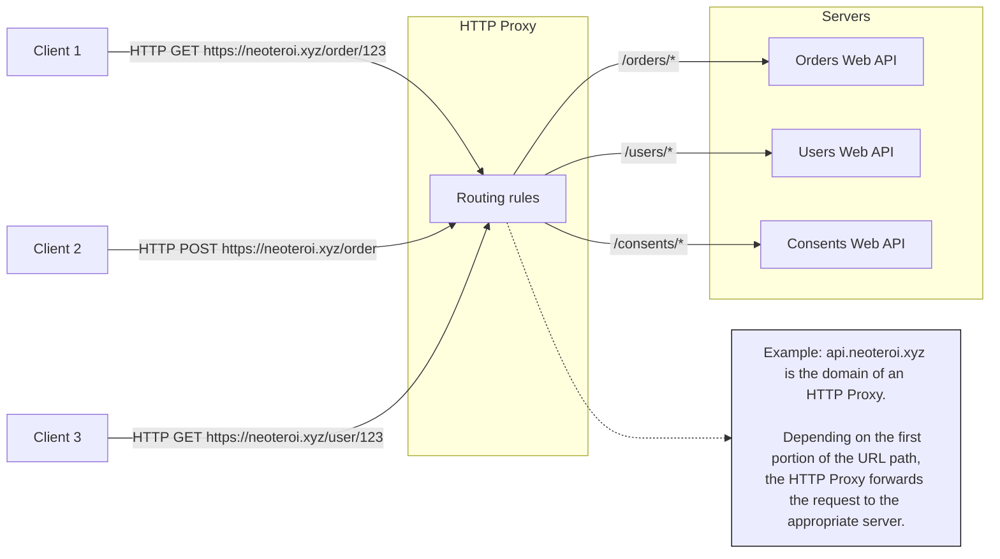
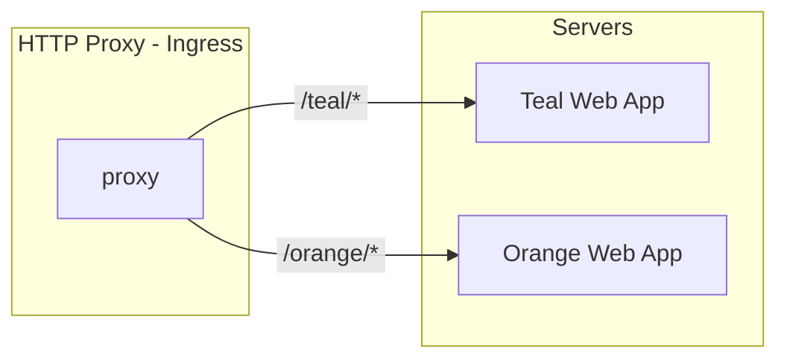

This page describes my first exercise with Kubernetes. I wanted to learn how to host
multiple web applications running in the cluster and expose them to the outside world. I
also wanted to configure *HTTPS* using a self-signed certificate, for non-production
environments.

The objective was also to host each web application in its own _Kubernetes
namespace_, and expose them to the outside world using rules depending on the URL path
and hostname. Using dedicated _namespaces_ allows several teams to work on the same
cluster without interfering with each other, and the same team to work on multiple
systems on the same cluster.



For this exercise, I wanted to start with a simple scenario like in the following diagram:



For the teal and orange web app, I will use the Docker image I prepared for a project
template for my own web framework, `BlackSheep`, which is available on GitHub and on
DockerHub:

- [BlackSheep MVC project template on GitHub](https://github.com/neoteroi/blacksheep-mvc).
- [MVC Demo on DockerHub](https://hub.docker.com/r/robertoprevato/mvcdemo).

The web application and the Docker image are configured to support displaying a
different background color by environment variable, and to support being exposed
at a specific URL path prefix by environment variable.

For instance, to test the application directly with Docker and fetching the image from
DockerHub, you can run the following command:

```bash
docker run --name mvcdemo --rm -p 8080:80 \
    -e BG_COLOR='#fd7e14' \
    -e APP_ROUTE_PREFIX='orange' \
    robertoprevato/mvcdemo
```

/// details | The docker command described.
    type: example

- Runs a Docker container named `mvcdemo` from the `robertoprevato/mvcdemo` image,
  which will be downloaded from [Docker Hub](https://hub.docker.com/r/robertoprevato/mvcdemo).
- Removes the container automatically after it stops (`--rm`).
- Maps port 8080 on the host to port 80 in the container (`-p 8080:80`).
- Sets the environment variable `BG_COLOR` to `#fd7e14` (orange background).
- Sets the environment variable `APP_ROUTE_PREFIX` to `orange` (application will be accessible at `/orange`).
- Starts the containerized web application, ready to be accessed at *[http://localhost:8080/orange](http://localhost:8080/orange)*.

///

And then navigate to *[http://localhost:8080/orange](http://localhost:8080/orange)* in your web browser. The page should
display like in the picture below:


Now stop the container with:

```bash
docker stop mvcdemo
```

As we want to later host the application in Kubernetes, we don't need to have it
running in Docker.

## Introduction to Ingress

In Kubernetes, **Ingress** acts as a gateway that manages external access to services
within a cluster, primarily for HTTP and HTTPS traffic.

*Kind* supports different ways to direct internet traffic to `Services` inside the cluster,
documented here: [_Ingress_](https://kind.sigs.k8s.io/docs/user/ingress/).

- Using a [_LoadBalancer_ and _Cloud Provider KIND_](https://kind.sigs.k8s.io/docs/user/loadbalancer/).
- Leveraging the `extraPortMapping` config option when creating a cluster to forward
  ports from the host.

I tested both options, and I found the second to be more convenient because it is easier
to use and is more stable across reboots and Docker daemon restarts.

## Creating a cluster with extra config

If you created a cluster previously, delete it with:

```bash
kind delete cluster
```

To create a cluster with *extra port mappings*, create a configuration file `kind.yaml`
with the following content:

```yaml
kind: Cluster
apiVersion: kind.x-k8s.io/v1alpha4
nodes:
  - role: control-plane
    extraPortMappings:
      - containerPort: 80
        hostPort: 80
        protocol: TCP
      - containerPort: 443
        hostPort: 443
        protocol: TCP
```

And then create the cluster with:

```bash
kind create cluster --config kind.yaml
```

This configuration will create a single-node cluster with the control plane node, and it
will forward ports 80 and 443 from the host to the container.

Although this is a single-node cluster, it is sufficient for testing purposes, and it
works reliably across system reboots and Docker daemon restarts.

Before going deeper into Kubernetes, I wanted to create a self-signed certificate to
handle HTTPS traffic. The following paragraph describes how to create a self-signed
SSL certificate for local development and use it in Kubernetes.

## Create a self-signed SSL certificate for local development

For my exercises, I decided to use the domain `neoteroi.xyz` for the web applications I
will host in the cluster. Change the name to whatever you like, while following my
notes below.

To create a self-signed SSL certificate for local development, do the following:

Create a config file for Subject Alternative Names (SAN). Create a file named `san.cnf`
with the following content:

```ini
[req]
default_bits = 2048
prompt = no
default_md = sha256
distinguished_name = dn
req_extensions = req_ext

[dn]
CN = neoteroi.xyz

[req_ext]
subjectAltName = @alt_names

[alt_names]
DNS.1 = neoteroi.xyz
DNS.2 = www.neoteroi.xyz
```

Generate the self-signed certificate and private key, using openssl.

```bash
openssl req -x509 -nodes -days 365 -newkey rsa:2048 \
  -keyout neoteroi-xyz-tls.key \
  -out neoteroi-xyz-tls.crt \
  -config san.cnf
```

This command will generate a private key (`neoteroi-xyz-tls.key`) and a self-signed
certificate (`neoteroi-xyz-tls.crt`) valid for 365 days.

Later we will create a Kubernetes secret to store the certificate and key, and configure
the ingress to use the secret for TLS.

---

## Configuring Ingress with NGINX and Kind

To configure an ingress controller with NGINX:

1. Follow the instructions here https://kind.sigs.k8s.io/docs/user/ingress/
2. Create an ingress controller with:

```bash
kubectl apply -f https://kind.sigs.k8s.io/examples/ingress/deploy-ingress-nginx.yaml
```

3. Make sure it starts, running the command below.

```bash
kubectl wait --namespace ingress-nginx \
  --for=condition=ready pod \
  --selector=app.kubernetes.io/component=controller \
  --timeout=90s
```

If the command above times out, you can check the status of the pods in the
`ingress-nginx` namespace with:

```bash
kubectl get pods -n ingress-nginx

kubectl describe pod <name-of-pod> -n ingress-nginx
```

If your internet connection is slow, it may take a while to download the `NGINX`
controller image.

### Creating the demo web applications

Clone the repository to obtain the example files for `01-web-hosting`. CD with Bash
to the `examples/01-web-hosting` directory, then run the following commands to create
two namespaces (`orange` and `teal`) and run two Kubernetes deployments in them:

```bash
kubectl create namespace orange

kubectl apply -n orange -f orange.yaml

kubectl create namespace teal

kubectl apply -n teal -f teal.yaml
```

For reference, here is the content of `orange.yaml`:

```yaml
apiVersion: apps/v1
kind: Deployment
metadata:
  name: orange-app
spec:
  replicas: 1
  selector:
    matchLabels:
      app: orange-app
  template:
    metadata:
      labels:
        app: orange-app
    spec:
      tolerations:
        - key: "CriticalAddonsOnly"
          operator: "Exists"
          effect: "NoSchedule"
      containers:
        - name: orange-app
          image: robertoprevato/mvcdemo:latest
          env:
            - name: BG_COLOR
              value: "#fd7e14"
            - name: APP_ROUTE_PREFIX
              value: orange
          ports:
            - containerPort: 80
          readinessProbe:
            httpGet:
              path: /orange/
              port: 80
            initialDelaySeconds: 5
            periodSeconds: 10
          livenessProbe:
            httpGet:
              path: /orange/
              port: 80
            initialDelaySeconds: 15
            periodSeconds: 20
---
apiVersion: v1
kind: Service
metadata:
  name: orange-app
spec:
  ports:
    - port: 80
      targetPort: 80
  selector:
    app: orange-app
  type: ClusterIP
---
```

This YAML configuration defines two Kubernetes resources for the orange web application:

- **Deployment**: Creates a single replica of the `orange-app` container using the
  `robertoprevato/mvcdemo:latest` image. The deployment sets environment variables to
  configure the background color and route prefix, exposes port 80, and includes
  readiness and liveness probes to monitor the application's health.
- **Service**: Exposes the deployed pod internally within the cluster as a `ClusterIP`
  service on port 80, allowing other resources in the cluster to communicate with the
  orange web application.

### Configuring Ingress rules

After following the instructions above, configure ingress rules using the following
commands:

- Create a namespace for common ingress resources.
- Create a TLS secret with the self-signed certificate and key.
- Apply the common ingress configuration, to route traffic to the
  backend services in their own namespace.

```bash
kubectl create namespace common-ingress

cd ssl
kubectl create secret tls neoteroi-xyz-tls \
  --cert=neoteroi-xyz-tls.crt \
  --key=neoteroi-xyz-tls.key \
  -n common-ingress

cd ../
kubectl apply -n common-ingress -f common-ingress.yaml
```

`common-ingress.yaml` is the configuration file that defines the ingress rules and
services for the orange and teal web applications, which is shown below:

```yaml {linenums="1" hl_lines="10-14 16 19-20 26-27 33 36-37 43-44"}
# common-ingress.yaml
---
apiVersion: networking.k8s.io/v1
kind: Ingress
metadata:
  name: common-ingress
  namespace: common-ingress
spec:
  ingressClassName: nginx
  tls:
    - hosts:
        - neoteroi.xyz
        - www.neoteroi.xyz
      secretName: neoteroi-xyz-tls
  rules:
    - host: neoteroi.xyz
      http:
        paths:
          - path: /orange
            pathType: Prefix
            backend:
              service:
                name: orange-app
                port:
                  number: 80
          - path: /teal
            pathType: Prefix
            backend:
              service:
                name: teal-app
                port:
                  number: 80
    - host: www.neoteroi.xyz
      http:
        paths:
          - path: /orange
            pathType: Prefix
            backend:
              service:
                name: orange-app
                port:
                  number: 80
          - path: /teal
            pathType: Prefix
            backend:
              service:
                name: teal-app
                port:
                  number: 80
---
apiVersion: v1
kind: Service
metadata:
  name: orange-app
  namespace: common-ingress
spec:
  type: ExternalName
  externalName: orange-app.orange.svc.cluster.local
  ports:
    - port: 80
      targetPort: 80
---
apiVersion: v1
kind: Service
metadata:
  name: teal-app
  namespace: common-ingress
spec:
  type: ExternalName
  externalName: teal-app.teal.svc.cluster.local
  ports:
    - port: 80
      targetPort: 80
```

This YAML configuration defines three Kubernetes resources:

- **Ingress (`common-ingress`)**: Configured in the `common-ingress` namespace, this
  resource uses the NGINX ingress controller to route external HTTPS traffic for the
  domains `neoteroi.xyz` and `www.neoteroi.xyz`. It uses a TLS secret for SSL
  termination. The ingress forwards requests with the `/orange` and `/teal` path
  prefixes to the corresponding backend services.

- **Service (`orange-app` and `teal-app`)**: These are `ExternalName` services in the
  `common-ingress` namespace. Each service points to the actual application service
  running in its respective namespace (`orange` or `teal`). This allows the ingress to
  route traffic to services in other namespaces by referencing them via their fully
  qualified domain names within the cluster.

Together, these resources enable secure external access to multiple web applications
hosted in different namespaces, using a single ingress point and path-based routing.

### Modify your hosts file

To test the applications, you need to modify your `hosts` file (`/etc/hosts` on Linux
and macOS, or `C:\Windows\System32\drivers\etc\hosts` on Windows) to map the domains
`neoteroi.xyz` and `www.neoteroi.xyz` to `127.0.0.1` (localhost). Add the following
lines:

```
127.0.0.1  neoteroi.xyz
127.0.0.1  www.neoteroi.xyz
```

/// note | Note about the hosts file.

We modified the hosts file to point the custom domains to the host (`localhost`) because
I decided to use `extra port mappings` with `Kind`. If we used instead the cloud provider
load balancer option, we would need to modify the hosts file to point to the
`External IP` of the load balancer, obtained with the command:

```bash
kubectl get svc -n ingress-nginx
```

I am using extra port mappings because it is easier to set up and works reliably across
system reboots and Docker daemon restarts.

///

### Testing the applications

Open a web browser and navigate to the following URLs:

- `https://neoteroi.xyz/orange/` - should display the orange web application.
- `https://neoteroi.xyz/teal/` - should display the teal web application.

If you see a warning about the self-signed certificate, you can safely ignore it for
local development purposes. The application at *[https://www.neoteroi.xyz/teal/](https://www.neoteroi.xyz/teal/)* should
display like in the pictures below:


### Using k9s

To visualize the resources in the Kubernetes cluster, run `k9s` in a terminal.

k9s can be used to inspect the cluster resources, such as namespaces, pods, services,
and ingress rules. It provides a terminal-based user interface to navigate and manage
these resources easily.

To run a command, click `:`, then type `namespace` to list the namespaces. Then use the
arrow keys to navigate to a namespace and press `Enter` to switch to it. You can also
use the `/` key to search for resources by name.

The screenshots below show the list of namespaces and the logs of a container in the
`orange` namespace:


## Summary

This exercise demonstrated how to set up a Kubernetes cluster with Ingress to host
multiple web applications, each in its own namespace, and expose them to the outside
world using a self-signed SSL certificate.

The cluster was created using *Kind* with extra port mappings to forward HTTP and HTTPS
traffic from the host to the cluster.

## Next steps

The next page describes my second exercise with `Kind` and `Kubernetes`: how to use
_volume mounts_ to persist data on the host running `Kubernetes` and `Kind`, used by
containers running inside _pods_ of the cluster.
