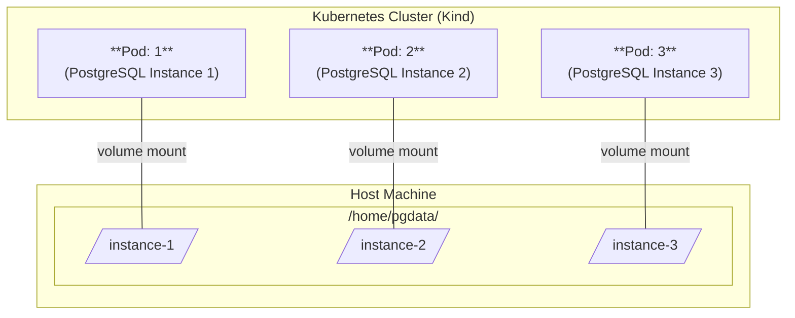

Now I want to try the Zalando PostgreSQL operator, which is another interesting
operator for managing PostgreSQL clusters in Kubernetes. I headed towards the
[_Quickstart guide_](https://opensource.zalando.com/postgres-operator/docs/quickstart.html),
and tried following the steps to use it in a kind cluster.

```bash
kind create cluster --name zalandopg

kubectl cluster-info --context kind-zalandopg
```

## Quickstart

### Install the operator

I decided to use the manual way of installing the operator and using the
_Kustomize_, like documented:

```bash
kubectl apply -k github.com/zalando/postgres-operator/manifests
```

Check if the operator pod starts:

```bash
watch kubectl get pod -l name=postgres-operator
```

In case of issues, check the logs of the operator pod:

```bash
kubectl logs "$(kubectl get pod -l name=postgres-operator --output='name')"
```

/// details | About Kustomize.

Kustomize is a tool that allows you to customize Kubernetes YAML configurations
without the need to modify the original files. It is built into `kubectl` and
provides a way to manage Kubernetes resources in a more flexible and reusable
manner. Kustomize allows you to create overlays, which are modifications to the
base configurations, enabling you to apply different settings for different
environments or use cases without duplicating the entire configuration.

Read more about Kustomize in the [Kustomize documentation](https://kubernetes.io/docs/tasks/manage-kubernetes-objects/kustomization/).

///

### Create a PostgreSQL Cluster

Create a cluster using the minimal example:

```bash
kubectl apply -f https://raw.githubusercontent.com/zalando/postgres-operator/refs/heads/master/manifests/minimal-postgres-manifest.yaml
```

At the time of this writing, the minimal manifest looks like this:

```yaml
apiVersion: "acid.zalan.do/v1"
kind: postgresql
metadata:
  name: acid-minimal-cluster
spec:
  teamId: "acid"
  volume:
    size: 1Gi
  numberOfInstances: 2
  users:
    zalando:  # database owner
    - superuser
    - createdb
    foo_user: []  # role for application foo
  databases:
    foo: zalando  # dbname: owner
  preparedDatabases:
    bar: {}
  postgresql:
    version: "17"
```

After several seconds, you should see running pods:

```bash {hl_lines="3-4"}
kubectl get pods
NAME                                 READY   STATUS    RESTARTS      AGE
acid-minimal-cluster-0               1/1     Running   0             3m37s
acid-minimal-cluster-1               1/1     Running   0             40s
postgres-operator-849bdbdbd8-2r2pz   1/1     Running   1 (10m ago)   11m
```

### Connect to the cluster

Connecting to the cluster using `port-forward` proved to be more complicated
than expected. At first I tried to obtain the list of services, and use
`kubectl port-forward` to connect to the PostgreSQL service, but that fails
with: _error: cannot attach to *v1.Service: invalid service
'acid-minimal-cluster': Service is defined without a selector_.

I read about this issue in the Zalando documentation and GitHub issues, which explains that
Zalando PostgreSQL clusters do not expose a service for the master pod by
default. Instead, you need to connect directly to the master pod.

The following command is used to forward the PostgreSQL port from the Zalando PostgreSQL cluster to the local machine:

```bash
cluster_name="acid-minimal-cluster"

kubectl port-forward $(kubectl get pod -l cluster-name=$cluster_name,spilo-role=master -o jsonpath='{.items[0].metadata.name}') 5432:5432
```

In another terminal:

```bash
cluster_name="acid-minimal-cluster"
# obtain the password:
user="zalando"
export PGPASSWORD=$(kubectl get secret $user.$cluster_name.credentials.postgresql.acid.zalan.do -o 'jsonpath={.data.password}' | base64 -d)

# connect to the database using psql
psql -h localhost -U $user -d foo
```

You should enter the PostgreSQL shell, and you can run `\l` to list the databases:

```sql
psql (17.5 (Ubuntu 17.5-1.pgdg24.04+1), server 17.2 (Ubuntu 17.2-1.pgdg22.04+1))
SSL connection (protocol: TLSv1.3, cipher: TLS_AES_256_GCM_SHA384, compression: off, ALPN: postgresql)
Type "help" for help.

foo=# \l
                                                      List of databases
   Name    |   Owner   | Encoding | Locale Provider |   Collate   |    Ctype    | Locale | ICU Rules |   Access privileges
-----------+-----------+----------+-----------------+-------------+-------------+--------+-----------+-----------------------
 bar       | bar_owner | UTF8     | libc            | en_US.utf-8 | en_US.utf-8 |        |           |
 foo       | zalando   | UTF8     | libc            | en_US.utf-8 | en_US.utf-8 |        |           |
 postgres  | postgres  | UTF8     | libc            | en_US.utf-8 | en_US.utf-8 |        |           |
 template0 | postgres  | UTF8     | libc            | en_US.utf-8 | en_US.utf-8 |        |           | =c/postgres          +
           |           |          |                 |             |             |        |           | postgres=CTc/postgres
 template1 | postgres  | UTF8     | libc            | en_US.utf-8 | en_US.utf-8 |        |           | =c/postgres          +
           |           |          |                 |             |             |        |           | postgres=CTc/postgres
(5 rows)
```

Let's create a table and insert some data:

```sql
CREATE TABLE cookie (
    id SERIAL PRIMARY KEY,
    text TEXT NOT NULL
);

INSERT INTO cookie (text) VALUES ('You will eat more cookies today.');

INSERT INTO cookie (text) VALUES ('Sleep more.');

SELECT * FROM cookie;
```

### Verify replication

Now let's verify that the replication works by connecting to the second pod in
the cluster, to verify that the `cookie` table is replicated:

```bash
# inspect the labels of the pods
kubectl get pods --show-labels

cluster_name="acid-minimal-cluster"
kubectl port-forward $(kubectl get pod -l cluster-name=$cluster_name,spilo-role=replica -o jsonpath='{.items[0].metadata.name}') 5432
```

The table was replicated, and we can see the data:

```
psql -h localhost -U zalando -d foo
psql (17.5 (Ubuntu 17.5-1.pgdg24.04+1), server 17.2 (Ubuntu 17.2-1.pgdg22.04+1))
SSL connection (protocol: TLSv1.3, cipher: TLS_AES_256_GCM_SHA384, compression: off, ALPN: postgresql)
Type "help" for help.

foo=# \dt
         List of relations
 Schema |  Name  | Type  |  Owner
--------+--------+-------+---------
 public | cookie | table | zalando
(1 row)

foo=# select * from cookie;
 id |               text
----+----------------------------------
  1 | You will eat more cookies today.
  2 | Sleep more.
(2 rows)
```

Verify that you are connected to the replica pod:

```sql {hl_lines="2"}
foo=# INSERT INTO cookie (text) VALUES ('This should not work.');
ERROR:  cannot execute INSERT in a read-only transaction
```

Wonderful!

## Reading time…

The first impressions are great, and

## Include a Load Balancer

To include a Load Balancer with Zalando PostgreSQL operator, you should modify
the operator's configuration to expose the `master` instance. This
documentation describes how to configure the operator:
[Configuration parameters](https://opensource.zalando.com/postgres-operator/docs/reference/operator_parameters.html),
and the setting of interest in this case is:
`enable_master_load_balancer`, that must be set to `true` in the
`postgres-operator` configuration.

To follow more easily, clone the Zalando's repository, using
`--depth` to avoid downloading the entire history:

```bash
git clone --depth 10 https://github.com/zalando/postgres-operator.git
```

### Modify the operator configuration

Navigate to the `manifests` directory in the cloned repository:

```bash
cd postgres-operator/manifests
```

Edit the file `configmap.yaml` file to enable a load balancer:

```yaml
  enable_master_load_balancer: "true"
```

Apply the modified configuration:

```bash
# examples/07-zalandopg
kubectl apply -f configmap.yaml
```

Now, I was wondering if the operator would automatically pick up the new
configuration, and the answer is **no**, because of the issue described here:
[Operator ignores OperatorConfiguration changes #1315](https://github.com/zalando/postgres-operator/issues/1315).

To apply the new configuration, you can force the recreation of the operator pod:

```bash
kubectl delete pod -l name=postgres-operator
```

Remember to run the `cloud-provider-kind` in a different terminal, so that the
new Load Balancer can receive an _External IP_. Then check the services:

```bash {hl_lines="3"}
$ kubectl get svc
NAME                          TYPE           CLUSTER-IP      EXTERNAL-IP   PORT(S)          AGE
acid-minimal-cluster          LoadBalancer   10.96.104.207   172.18.0.5    5432:31691/TCP   8h
acid-minimal-cluster-config   ClusterIP      None            <none>        <none>           8h
acid-minimal-cluster-repl     ClusterIP      10.96.22.218    <none>        5432/TCP         8h
kubernetes                    ClusterIP      10.96.0.1       <none>        443/TCP          8h
postgres-operator             ClusterIP      10.96.116.206   <none>        8080/TCP         8h
```

Let's try to connect to the PostgreSQL cluster using the Load Balancer:

```bash
LB_IP=$(kubectl get svc acid-minimal-cluster -o jsonpath='{.status.loadBalancer.ingress[0].ip}')

export PGPASSWORD=$(kubectl get secret zalando.acid-minimal-cluster.credentials.postgresql.acid.zalan.do -o 'jsonpath={.data.password}' | base64 -d)

psql -h $LB_IP -U zalando -d foo
```

And... :boom: :boom:! It doesn't work. I needed to investigate why the connection
fails. I couldn't find the information in the documentation, but I
found the answer looking at GitHub issues. The best instruction was here:
[_issue #2365_](https://github.com/zalando/postgres-operator/issues/2365).

Modify the `minimal-postgres-manifest-01.yaml` file to include the desired allowed
[CIDR ranges](https://en.wikipedia.org/wiki/Classless_Inter-Domain_Routing):

```yaml {linenums=1 hl_lines="7-8"}
apiVersion: "acid.zalan.do/v1"
kind: postgresql
metadata:
  name: acid-minimal-cluster
spec:
  teamId: "acid"
  allowedSourceRanges:
  - 0.0.0.0/0  # allow all IPs to connect
  volume:
    size: 1Gi
  numberOfInstances: 2
  users:
    zalando:  # database owner
    - superuser
    - createdb
    foo_user: []  # role for application foo
  databases:
    foo: zalando  # dbname: owner
  preparedDatabases:
    bar: {}
  postgresql:
    version: "17"
```

For **local development** purposes, I am allowing all IPs (`0.0.0.0/0`).
Apply the modified manifest:

```bash
# examples/07-zalandopg
kubectl apply -f minimal-postgres-manifest-01.yaml
```

Now try to connect again, it should work:

```bash
psql -h $LB_IP -U $user -d foo
psql (17.5 (Ubuntu 17.5-1.pgdg24.04+1), server 17.2 (Ubuntu 17.2-1.pgdg22.04+1))
SSL connection (protocol: TLSv1.3, cipher: TLS_AES_256_GCM_SHA384, compression: off, ALPN: postgresql)
Type "help" for help.

foo=#
```

Hurray! :tada:

## Share storage for local development

I wanted to try again what I wanted to do with [_CloudNativePG_](./cloudnativepg.md#share-storage-for-local-development),



I looked for information, and apparently Zalando PO supports the scenario I desire for
local development:

- possibility to use a local folder for each local PostgreSQL Server instance.
- possibility to reuse the same folders across cluster recreation (the possibility of
  deleting and recreating a cluster with the same name and namespace, picking up
  `pgdata` from previous runs).

### Local Path Provisioner

Kubernetes in Docker (Kind) by default includes [_Rancher's Local Path Provisioner_](https://github.com/rancher/local-path-provisioner),
which allows you to use local directories as persistent storage for your Kubernetes pods,
dynamically provisioned. A local PV provisioner (like local-path-provisioner)
automatically creates a unique directory on the host for each PersistentVolumeClaim (PVC),
ensuring each PostgreSQL pod gets its own isolated storage.

Rancher's Local Path Provisioner by default uses the root path:
`/var/local-path-provisioner` on the host, to create folders dedicated to each pod and
persistent volume, following the naming convention: `/var/local-path-provisioner/pvc-<pvc-uid>`.

You can see the available storage classes with the command `kubectl get storageclass`:

```bash
$ kubectl get storageclass
NAME                 PROVISIONER                    RECLAIMPOLICY   VOLUMEBINDINGMODE      ALLOWVOLUMEEXPANSION   AGE
cnpg-hostpath        kubernetes.io/no-provisioner   Delete          WaitForFirstConsumer   false                  3d15h
standard (default)   rancher.io/local-path          Delete          WaitForFirstConsumer  false                  3d15h
```

Note that the `ReclaimPolicy` is set to _Delete_ by default, therefore when a
PersistentVolumeClaim (PVC) is deleted, the associated storage volume is also deleted.
We can create a new StorageClass with `ReclaimPolicy` set to _Retain_:

```yaml
apiVersion: storage.k8s.io/v1
kind: StorageClass
metadata:
  name: local-path-retain
provisioner: rancher.io/local-path
reclaimPolicy: Retain
volumeBindingMode: WaitForFirstConsumer
```

```bash
# ./examples/07-zalandopg/rancher/
kubectl apply -f retain-local-storageclass.yaml
```

Verify that the storage class is created:

```bash
$ kubectl get storageclass local-path-retain
NAME                PROVISIONER             RECLAIMPOLICY   VOLUMEBINDINGMODE      ALLOWVOLUMEEXPANSION   AGE
local-path-retain   rancher.io/local-path   Retain          WaitForFirstConsumer   false                  70s
```

This ensures that when the PVC is deleted, the underlying PV (and its data directory) is
not deleted.

### Test the retain

To find which folder is used by Rancher's Local Path Provisioner, run the command:

```bash
kubectl -n local-path-storage get configmap local-path-config -o yaml | grep path
```

In my case, that is `/var/local-path-provisioner/`

```bash {hl_lines="1"}
$ kubectl -n local-path-storage get configmap local-path-config -o yaml | grep path
                    "paths":["/var/local-path-provisioner"]
```

```bash
# ./examples/07-zalandopg/rancher/
sudo mkdir /var/local-path-provisioner/
sudo chmod -R 777 /var/local-path-provisioner/

kind create cluster --config kind.yaml --name localstorage

kubectl cluster-info --context kind-localstorage

kubectl apply -f retain-local-storageclass.yaml

kubectl apply -f pvc.yaml

kubectl apply -f pod.yaml

# write something into the pod
kubectl exec volume-test -- sh -c "echo 'Hello World' > /data/test.txt"
```

Since the `local-path-provisioner` is using the `/var/local-path-provisioner/`
directory and this folder was mounted from the host, you should see a new folder created
for your PVC under this path.

```bash
$ cd /var/local-path-provisioner
$ tree
.
└── pvc-741d51ce-b9c0-4bf0-9700-574a407e2e07_default_local-path-pvc
    └── test.txt

$ cat pvc*/test.txt
Hello World
```

/// details | Entering Kind nodes.
    type: example

I had some issues detecting the path used by Rancher, and I had to enter the nodes
created by Kind. To do that, I did the following, starting from the `host`:

```bash
docker exec -it localstorage-control-plane /bin/bash

# see running containers inside the Docker container
crictl ps

# enter a container by ID (by name it does not work)
crictl exec -it <container-id> sh

crictl exec -it 39e042ab62599 cat /data/test.txt
Hello World
```

In alternative, you can also use `kubectl` from the host:

```bash
kubectl exec -it <pod-name> -- <command>
```

**Examples:**

To open a shell in a pod named `volume-test`:

```bash
kubectl exec -it volume-test -- sh
```

To read a file named `test.txt` in the `/data` directory of the `volume-test` pod:

```bash
kubectl exec -it volume-test -- cat /data/test.txt
```

///

Now, to verify that folders are retained:

- Delete the pod.
- Recreate the pod.
- Verify that the data is still present.

```bash
kubectl delete pod volume-test

kubectl apply -f pod.yaml

kubectl exec -it volume-test -- cat /data/test.txt
```

The new POD reuses the same persistent volume (PV). :material-check:

Try deleting the whole cluster:

```bash
kind delete cluster --name localstorage
```

Verify that the folder on the host was not deleted:

```bash
$ cat /var/local-path-provisioner/pvc*/test.txt
Hello World
```

Recreate everything re-running the previous commands:

```bash
kind create cluster --config kind.yaml --name localstorage

kubectl cluster-info --context kind-localstorage

kubectl apply -f retain-local-storageclass.yaml

kubectl apply -f pvc.yaml

kubectl apply -f pod.yaml
```

Verify that the pod goes in `Running` state.

```bash
kubectl get pods
```

Check if the pod is using the previous folder:

```bash {hl_lines="2"}
kubectl exec -it volume-test -- cat /data/test.txt
cat: can't open '/data/test.txt': No such file or directory
```

**No**, it doesn't. You can verify that the host contains new PVC folders:

```bash
cd /var/local-path-provisioner
dir
pvc-741d51ce-b9c0-4bf0-9700-574a407e2e07_default_local-path-pvc  pvc-9f3d6269-9853-422e-99bf-f26bd3a27198_default_local-path-pvc
```

To reuse the same folder, it is necessary to provision the `Persistent Volume (PV)`
manually.

Clean up:

```bash
kind delete cluster --name localstorage
```

### Manual provisioning

To reuse the same folder, it is necessary to provision the `Persistent Volume (PV)`
manually. Note that `folder.yaml` includes a node affinity selector that matches the
Kind control plane created for the cluster with the name used below.

```bash
# ./examples/07-zalandopg/manual/
sudo mkdir /var/stores/1/
sudo chmod -R 777 /var/stores/

kind create cluster --config kind.yaml --name localstorage

kubectl cluster-info --context kind-localstorage

kubectl apply -f folder.yaml

kubectl apply -f pod.yaml

# write something into the pod
kubectl exec volume-test -- sh -c "echo 'Hello World' > /data/test.txt"

# verify that the data is written to the host
cat /var/stores/1/test.txt
```

Cool! Now, try deleting and recreating the cluster:

```bash
kind delete cluster --name localstorage

kind create cluster --config kind.yaml --name localstorage

kubectl cluster-info --context kind-localstorage

kubectl apply -f folder.yaml

kubectl apply -f pod.yaml
```

Verify that the pod is using the same data:

```bash
$ kubectl exec -it volume-test -- cat /data/test.txt
Hello World
```

### Attempt with Zalando PO

```bash
# examples/07-zalandopg
mkdir /var/stores/pgdata-{1,2}

kind delete cluster --name db

kind create cluster --config kind.yaml --name db

kubectl cluster-info --context kind-db

kubectl apply -k github.com/zalando/postgres-operator/manifests

kubectl apply -f configmap.yaml

kubectl delete pod -l name=postgres-operator

# verify the operator is running
watch kubectl get pod -l name=postgres-operator

kubectl apply -f volumes.yaml

kubectl apply -f minimal-postgres-manifest-02.yaml
```

Connect to the database server:

```bash
LB_IP=$(kubectl get svc acid-minimal-cluster -o jsonpath='{.status.loadBalancer.ingress[0].ip}')

export PGPASSWORD=$(kubectl get secret zalando.acid-minimal-cluster.credentials.postgresql.acid.zalan.do -o 'jsonpath={.data.password}' | base64 -d)

psql -h $LB_IP -U zalando -d foo
```

Create a table and insert some data, like we did previously.

```bash
# delete the cluster
kubectl delete postgresql acid-minimal-cluster

# recreate the cluster
kubectl apply -f minimal-postgres-manifest-02.yaml
```

**IT DOESN`T WORK!**. OK, better not trying this.

## The documentation is not great

The documentation is not great. :fontawesome-regular-thumbs-down: I needed to
google and rely on GitHub issues to learn more about how configuration changes
are applied and how to configure a useful load balancer. The documentation is
not very detailed.

## Confusing configuration

What is the difference between *pooler* and not **pooler** load balancer?

- `enable_replica_load_balancer`
- `enable_replica_pooler_load_balancer`

And these two:

- `enable_master_load_balancer`
- `enable_master_pooler_load_balancer`

## A look at GitHub issues

- [Operator ignores OperatorConfiguration changes #1315](https://github.com/zalando/postgres-operator/issues/1315).
- [Question: Can load balancers only be accessed from outside via node port?](https://github.com/zalando/postgres-operator/issues/2365).

> **Troubleshooting: Reusing pgdata folders after cluster recreation**
>
> If you delete and recreate the cluster but reuse the same `pgdata` folders, you may encounter authentication errors like:
>
> ```
> psycopg2.OperationalError: connection to server at ... failed: FATAL:  password authentication failed for user "postgres"
> ```
> or
> ```
> FATAL:  pg_hba.conf rejects connection for host ..., user "postgres", database ...
> ```
>
> This happens because the PostgreSQL data directory still contains the old user credentials and configuration, but the Kubernetes secrets (such as passwords) are regenerated and do not match the existing database. To avoid this:
>
> - **Option 1:** Restore the original secrets (especially the credentials secret) that were used with the data directory.
> - **Option 2:** Delete the old data directories before recreating the cluster, so that new secrets and a fresh database are created in sync.
>
> If you want to persist data across cluster recreation, you must persist both the data directories and the corresponding secrets.
