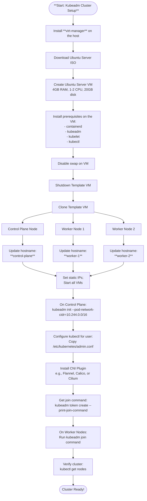

After exploring [Kind](../kind/creating-a-cluster.md) and [K3s](../k3s/index.md) in previous exercises,
I want to practice with **`kubeadm`**. Using [**`kubeadm`**](https://kubernetes.io/docs/setup/production-environment/tools/kubeadm/create-cluster-kubeadm/), you can create a minimum viable
Kubernetes cluster that conforms to best practices. In this page I describe how to
install `virt-manager` on a host running Ubuntu 24.04 and how to create a group of
virtual machines as a foundation to start studying `kubeadm`.

This page covers:

- [X] Using `virt-manager` to create virtual machines in Linux using KVM.
- [X] Creating nodes for Kubernetes using `virt-manager`.
- [X] Cloning and configuring VMs manually, to understand each step.
- [X] Cloning the VMs more efficiently, using `virt-sysprep` (best for automation).
- [X] Getting started with `kubeadm`.

## K3s vs kubeadm

**K3s** is a lightweight, batteries-included Kubernetes distribution that comes
pre-configured with many components (`Traefik` ingress controller, local storage
provider, etc.). It's production-ready and designed for simplicity, minimal resource
usage, and ease of management—especially suited for edge computing, IoT, and
resource-constrained environments.

**kubeadm** is the standard tool for bootstrapping Kubernetes clusters. It provides a
more manual, modular approach where you need to:

- Choose and install your own CNI (Container Network Interface) plugin
- Set up your own ingress controller
- Configure storage providers
- Make more infrastructure decisions

Both K3s and kubeadm are production-ready, but learning `kubeadm` provides a deeper
understanding of Kubernetes components and how they work together. It gives you hands-on
experience with the standard cluster bootstrap process used in traditional enterprise
deployments. This knowledge is directly applicable to managed Kubernetes services like
EKS, AKS, and GKE, which follow similar architectural patterns. Additionally, mastering
`kubeadm` provides the skills needed for Kubernetes certifications such as CKA, CKAD,
and CKS.

## Preparing the nodes

To practice with `kubeadm`, you need multiple nodes. One approach would be to work with
multiple physical computers. For instance, there are many tutorials on the web
explaining how to create Kubernetes clusters using Raspberry Pi. But for learning and
potentially also for work, I think it's best to use virtual machines. Using virtual
machines allows you to delete and recreate nodes more freely, to focus on the objective
to study Kubernetes, and it doesn't require dedicating physical space and purchasing
additional hardware (assuming that you have a good development computer). In the past I
used `Virtual Box` to create virtual machines on Ubuntu, but after reading a little on
today's options, I decided to use `virt-manager` instead.

For this exercise, I am using a **Lenovo P15 Gen 1** with 12 CPU cores, 32GB of RAM,
2.6 TB SSD, and running **Ubuntu Desktop 24.04**.

```bash
sudo apt install virt-manager

# add the user to necessary groups
sudo usermod -aG kvm,libvirt $USER

# Activate the libvirt group in the current shell (avoids needing to log out/in)
newgrp libvirt
```

### Overview

This is an overview of what I want to achieve:

1. Installing `virt-manager` on the host.
2. Preparing a virtual machine template for Kubernetes, with all necessary tools.
3. Creating virtual machines on the host, to have the nodes for Kubernetes.
4. Creating the cluster using `kubeadm` (control plane and worker nodes).

To use kubeadm to install a Kubernetes controller on a VM, you first need to install
**kubeadm**, **kubelet**, and **kubectl**, along with a container runtime, on the VM.
Then, run kubeadm init on that VM to initialize the control plane, and install a **CNI
plugin** for pod networking. Then **join worker nodes**.

The following diagram provides more details.



---

### Creating a VM using virt-manager

For practice, I start by creating an Ubuntu Server 24.04 virtual machine.
I downloaded the ISO of Ubuntu Server 24.04 from the [official site](https://ubuntu.com/download/server).

Use the controls in the graphical user interface to select the downloaded ISO file and
follow the steps to configure and install Ubuntu Server. The screenshots below show the
passages I followed.

For now, I assign:

- **CPU**: 2 cores
- **RAM**: 4 GB
- **Disk**: 100 GB


After installing Ubuntu Server, navigate to the VM details, select the CD ROM device and
remove the installation medium clicking on the icon to clear the source path and click
the 'Apply' button.

During the installation of Ubuntu Server, I enabled OpenSSH. It is possible to import
public keys for SSH authentication from two sources, including GitHub. This will make
installing tools easier, as we can SSH from the host into the virtual machine.

### Virtual Networks

With `virt-manager`, it is possible to configure virtual networks.
To configure virtual networks, you can use the main menu and navigate to: `Edit > Connection Details > Virtual Networks`.
However, for now, I will stick to the default virtual network `192.168.122.0/24`.

### Installing tools

We could install tools directly in the virtual machines using the console provided by
`virt-manager`, but to do this comfortably we would need to enable clipboard support
(to copy commands from the host and paste them into the virtual machine).
A more comfortable option, in my opinion, is to SSH from the host into the virtual
machine.

Obtain the IP address of the VM from within, using the console in `virt-manager`, to
then SSH into the VM from a regular terminal.

```bash
# on the vm…
hostname -I
```

```bash
# from the host… ssh username@ip
ssh ro@192.168.122.116
```

Once on the VM, we need to follow the instructions at [_Installing kubeadm_](https://kubernetes.io/docs/setup/production-environment/tools/kubeadm/install-kubeadm/).

**Install containerd.**

```bash
# Install containerd
sudo apt update
sudo apt install -y containerd

# Configure containerd
sudo mkdir -p /etc/containerd
containerd config default | sudo tee /etc/containerd/config.toml

# Enable SystemdCgroup (required for kubeadm)
sudo sed -i 's/SystemdCgroup = false/SystemdCgroup = true/' /etc/containerd/config.toml

# Restart containerd
sudo systemctl restart containerd
sudo systemctl enable containerd

# Verify status
sudo systemctl status containerd
```

**Disable swap.**

```bash
# Disable swap…
sudo swapoff -a

# Comment out swap entries in /etc/fstab
sudo sed -i '/ swap / s/^/#/' /etc/fstab

# Check current swap status (should be empty)
sudo swapon --show

# Comment the swap line in /etc/fstab, adding #
sudo nano /etc/fstab
```

**Install kubeadm, kubelet and kubectl.**

- **kubeadm**: the command to bootstrap the cluster.
- **kubelet**: the component that runs on all of the machines in your cluster and does
  things like starting pods and containers.
- **kubectl**: the command line util to talk to your cluster.

```bash
sudo apt-get update

sudo apt-get install -y apt-transport-https ca-certificates curl gpg

curl -fsSL https://pkgs.k8s.io/core:/stable:/v1.34/deb/Release.key | sudo gpg --dearmor -o /etc/apt/keyrings/kubernetes-apt-keyring.gpg

echo 'deb [signed-by=/etc/apt/keyrings/kubernetes-apt-keyring.gpg] https://pkgs.k8s.io/core:/stable:/v1.34/deb/ /' | sudo tee /etc/apt/sources.list.d/kubernetes.list

sudo apt-get update
sudo apt-get install -y kubelet kubeadm kubectl
sudo apt-mark hold kubelet kubeadm kubectl
```

**Ensure that cgroup drivers are configured.**

It's necessary to ensure the cgroup driver matches between `containerd` and `kubelet`.

Kubernetes requires that the container runtime (`containerd`) and `kubelet` use the same
cgroup driver. There are two options:

- `systemd` Recommended for systemd-based Linux distributions (like Ubuntu)
- `cgroupfs` Legacy option

By default, containerd uses cgroupfs `SystemdCgroup = false`; and kubelet on
Ubuntu 24.04 with systemd, defaults to systemd cgroup driver.
This mismatch causes problems, so you need to configure containerd to use systemd.

Always set `SystemdCgroup = true` in containerd config on systemd-based systems like
Ubuntu. This is the recommended configuration in the official Kubernetes documentation
and what you've correctly included in your notes.

```bash
# the following should return SystemdCgroup = true
grep SystemdCgroup /etc/containerd/config.toml
```

**Enable IP forwarding and bridge networking.**

Kubernetes requires IP forwarding and bridge networking to be enabled. Configure kernel
modules and sysctl parameters:

```bash
# Load required kernel modules
cat <<EOF | sudo tee /etc/modules-load.d/k8s.conf
overlay
br_netfilter
EOF

sudo modprobe overlay
sudo modprobe br_netfilter

# Configure sysctl parameters for Kubernetes networking
cat <<EOF | sudo tee /etc/sysctl.d/k8s.conf
net.bridge.bridge-nf-call-iptables  = 1
net.bridge.bridge-nf-call-ip6tables = 1
net.ipv4.ip_forward                 = 1
EOF

# Apply sysctl parameters without reboot
sudo sysctl --system

# Verify settings
sysctl net.bridge.bridge-nf-call-iptables net.bridge.bridge-nf-call-ip6tables net.ipv4.ip_forward
```

All three values should return `1`.

/// details | IP Forwarding and networking.
    type: example

**IP forwarding** (also called IP routing) allows a Linux machine to act as a router,
forwarding network packets between different network interfaces or networks.

In Kubernetes it is required for:

**Pod-to-Pod Communication Across Nodes**

- When a pod on `worker-1` (e.g., IP `10.244.1.5`) wants to talk to a pod on `worker-2`
  (e.g., IP `10.244.2.10`), the packet must be forwarded through the network stack
- Without IP forwarding enabled, the node would receive the packet but refuse to forward
  it to the destination network
- With IP forwarding enabled, the node can route the packet from one network interface
  to another

**Routing Between Pod Network and Host Network**

- Pods live in their own network namespace (e.g., `10.244.0.0/16` CIDR)
- The host lives in a different network (e.g., `192.168.122.0/24`)
- IP forwarding allows packets to flow between these different networks

**How It Works in Practice**

```
Pod A (10.244.1.5)        Pod B (10.244.2.10)
on worker-1               on worker-2
    ↓                         ↓
[veth pair]              [veth pair]
    ↓                         ↓
[cni0 bridge]            [cni0 bridge]
10.244.1.1               10.244.2.1
    ↓                         ↓
[worker-1 eth0]    →    [worker-2 eth0]
192.168.122.11          192.168.122.12
```

A **veth pair** (Virtual Ethernet pair) is a fundamental Linux networking construct used
in containerization. A **veth pair** is like a virtual ethernet cable with two ends.
Think of it as a pipe:

- Data sent into one end comes out the other end
- It connects two different network namespaces
- It's created as a pair: veth0 ↔ veth1

In Kubernetes, every pod gets its own network namespace (isolated network stack). To
connect the pod to the node's network, Kubernetes creates a veth pair:

```
┌─────────────────────────────────────┐
│         Pod Network Namespace       │
│                                     │
│  [Pod eth0] ← veth pair end 1       │
└─────────────────────────────────────┘
              ↕ (veth pair)
┌─────────────────────────────────────┐
│      Host/Node Network Namespace    │
│                                     │
│  veth pair end 2 → [cni0 bridge]    │
└─────────────────────────────────────┘
```

When a pod starts:

1. **Kubernetes creates a veth pair:** `veth0` and `vethXXXXX` (random name).
1. **One end goes into the pod:** Shows up as `eth0` inside the pod.
1. **Other end stays on the host:** Connected to the CNI bridge (like `cni0`).
1. **Traffic flows through the pair:** Pod sends packets → they appear on the bridge → get routed.

You can see veth interfaces on your nodes:

```bash
# On a worker node
ip link show | grep veth
# Output example:
# 5: veth1a2b3c4d@if4: <BROADCAST,MULTICAST,UP,LOWER_UP>
# 7: veth5e6f7g8h@if6: <BROADCAST,MULTICAST,UP,LOWER_UP>
```

Each `veth` interface corresponds to a running pod.

**What is the cni0 bridge?**

The **cni0 bridge** is a Linux bridge device created by the CNI plugin (like Flannel)
that acts as a virtual switch on each node. Think of it like a network switch that
connects all the pods on a single node together.

Key characteristics:

- **One bridge per node**: Each worker node has its own `cni0` bridge
- **Connects all local pods**: All veth pairs from pods on the same node connect to this bridge
- **Has its own IP**: The bridge gets an IP address from the pod CIDR (e.g., `10.244.1.1`)
- **Layer 2 device**: Works like a physical network switch, forwarding ethernet frames between connected interfaces

You can see the bridge on any node:

```bash
# On a worker node
ip addr show cni0
# Output example:
# 4: cni0: <BROADCAST,MULTICAST,UP,LOWER_UP> mtu 1450 qdisc noqueue state UP group default qlen 1000
#     link/ether 8a:4c:e8:34:12:6f brd ff:ff:ff:ff:ff:ff
#     inet 10.244.1.1/24 brd 10.244.1.255 scope global cni0
#        valid_lft forever preferred_lft forever
```

How it works:

```
Pod 1 (10.244.1.5)     Pod 2 (10.244.1.6)     Pod 3 (10.244.1.7)
     ↓                      ↓                      ↓
[veth1a2b3c4d]        [veth5e6f7g8h]        [veth9i0j1k2l]
     ↓                      ↓                      ↓
     └──────────────────────┴──────────────────────┘
                            ↓
                    [cni0 bridge: 10.244.1.1]
                            ↓
                    [node eth0: 192.168.122.11]
```

When Pod 1 wants to communicate with Pod 2 (same node):

- Packet goes through Pod 1's `veth pair` to the bridge
- Bridge forwards directly to Pod 2's `veth pair` (local switching)
- No need to leave the node!

When Pod 1 wants to communicate with a pod on another node:

- Packet goes through Pod 1's `veth pair` to the bridge
- Bridge forwards to the node's physical interface (eth0)
- Requires IP forwarding to route between bridge and eth0
- Packet travels across the network to the other node

---

When Pod A sends a packet to Pod B:

- Packet goes from Pod A's network namespace to the bridge on worker-1 (through `veth pair`)
- Linux kernel checks: "Should I forward this packet?"
- If `net.ipv4.ip_forward = 0`: **DROP** ❌
- If `net.ipv4.ip_forward = 1`: **FORWARD** ✅
- Packet is routed to worker-2's physical interface
- Worker-2 forwards it to its bridge, then to Pod B

**Services and Load Balancing**

- When you access a Kubernetes Service, kube-proxy sets up iptables/ipvs rules
- These rules rewrite packet destinations to forward traffic to the correct pod
- IP forwarding must be enabled for these iptables rules to work

**Without IP Forwarding:**

- Pods could only communicate with other pods on the **same node**
- Cross-node pod communication would fail
- Services wouldn't work properly
- External traffic couldn't reach pods

The other settings included are related:

- `net.bridge.bridge-nf-call-iptables = 1` - Allows iptables rules to process traffic
  crossing Linux bridges (the CNI uses bridges)
- `net.bridge.bridge-nf-call-ip6tables = 1` - Same for IPv6

These ensure that pod traffic going through bridges is also subject to iptables rules
(which Kubernetes uses for Services, NetworkPolicies, etc.).

Example:

```bash
# Without IP forwarding
curl http://10.244.2.10  # From worker-1 to pod on worker-2
# Result: Connection timeout or "Network unreachable"

# With IP forwarding enabled
curl http://10.244.2.10  # From worker-1 to pod on worker-2
# Result: Success! Packet is routed correctly
```

This is why `kubeadm` checks for IP forwarding during preflight checks—without it, the
cluster's networking simply won't function properly.

///

### Backup and reuse the VM template

There are several options to backup and reuse the VM template. For this use case, the
simplest approach is to copy the whole disk image.

```bash
sudo cp /var/lib/libvirt/images/ubuntu-server24.04-a.qcow2 ~/vm-templates/k8s-node-template.qcow2
```

When you need it, copy it back and define a new VM. Or use `virt-clone` directly from
this disk.

Optionally, clean the VM template:

```bash
sudo virt-sysprep -d ubuntu-server24.04-a
```

If you want to clone and keep the `authorized_keys` configured when preparing the
template, you can use the following approach:

```bash
VM=worker-4
TEMPLATE_VM_NAME="ubuntu-server24.04-a"

sudo virt-clone --original $TEMPLATE_VM_NAME \
    --name $VM \
    --auto-clone

sudo virt-sysprep -d $VM \
    --hostname $VM \
    --operations defaults,-ssh-userdir \
    --run-command 'ssh-keygen -A' \
    --run-command 'systemctl enable ssh' \
    --run-command 'echo "192.168.122.10 control-plane" >> /etc/hosts' \
    --run-command 'echo "192.168.122.11 worker-1" >> /etc/hosts' \
    --run-command 'echo "192.168.122.12 worker-2" >> /etc/hosts' \
    --run-command 'echo "192.168.122.13 worker-3" >> /etc/hosts'

# Get MAC address from the stopped VM
sudo virsh dumpxml $VM | grep "mac address" | awk -F"'" '{print $2}'
```

The options above preserve the `authorized_keys` file configured during VM creation.
Since clipboard functionality doesn't work out of the box in `virt-manager`, removing
`authorized_keys` creates an inconvenience: it's not easy to copy public SSH keys into
VMs using the console in the `virt-manager` GUI.

Another option is to re-add the SSH keys using the following command:

```bash
# Clean the template
sudo virt-sysprep -d ubuntu-server24.04-a

# Re-add your SSH public key
sudo virt-sysprep -d ubuntu-server24.04-a \
  --ssh-inject ro:file:/home/yourusername/.ssh/id_ed25519.pub
```

**Important:** change your username accordingly to match your host' username, and the
public SSH key to match its name (e.g, `id_rsa.pub`, `id_ed25519.pub`, etc.).

---

## Configuring node VMs manually

This section describes how to configure node VMs manually, using the `virt-manager`
graphical user interface and entering each VM using `SSH`. This is useful as a learning
exercise and to understand each step. However, it's pretty boring and inefficient if
done too often. If you wish, skip this part and go directly to the section describing
how to configure VMs in a more automation-friendly manner, at [_Using virt-sysprep_](#using-virt-sysprep).

---

Once the base VM template is ready, clone it three times into:

- **control-plane**
- **worker-1**
- **worker-2**
- **worker-3**


Start each of them one by one, and ssh into them to configure a hostname and optionally
a static IP for each node.

```bash
# change the hostname, for example, on the hostname
sudo hostnamectl set-hostname control-plane

# verify…
hostnamectl

# update /etc/hosts
127.0.1.1 control-plane
```

### Assign static IPs

Ubuntu Server 24.04 uses **Netplan** for network configuration.
The best option to assign static IPs to virtual machines is to keep the VMs
configured for DHCP, but assign static IPs by MAC address in the configuration of
the virtual network.

Step 1: obtain MAC address for each VM.

```bash
# List all VMs with their MAC addresses
sudo virsh dumpxml control-plane | grep "mac address"
sudo virsh dumpxml worker-1 | grep "mac address"
sudo virsh dumpxml worker-2 | grep "mac address"
sudo virsh dumpxml worker-3 | grep "mac address"

# Output will look like:
#  <mac address='52:54:00:d2:44:4c'/>
#  <mac address='52:54:00:93:2d:94'/>
#  <mac address='52:54:00:d8:2f:a0'/>
#  <mac address='52:54:00:e7:c6:37'/>
```

Or from `virt-manager` GUI:

- Open VM details.
- Go to "NIC" section.
- Note the MAC address.

Step 2: edit the virtual network.

```bash
sudo virsh net-edit default
```

Add DHCP Host Entries

```xml {linenums="1" hl_lines="10-14"}
<network>
  <name>default</name>
  <uuid>...</uuid>
  <forward mode='nat'/>
  <bridge name='virbr0' stp='on' delay='0'/>
  <mac address='52:54:00:xx:xx:xx'/>
  <ip address='192.168.122.1' netmask='255.255.255.0'>
    <dhcp>
      <range start='192.168.122.100' end='192.168.122.254'/>
      <!-- Static assignments -->
      <host mac='52:54:00:d2:44:4c' name='control-plane' ip='192.168.122.10'/>
      <host mac='52:54:00:93:2d:94' name='worker-1' ip='192.168.122.11'/>
      <host mac='52:54:00:d8:2f:a0' name='worker-2' ip='192.168.122.12'/>
      <host mac='52:54:00:e7:c6:37' name='worker-3' ip='192.168.122.13'/>
    </dhcp>
  </ip>
</network>
```

**Important:** Replace the MAC addresses with your actual MAC addresses from Step 1.

This method ensures that DHCP won't assign the IPs to other machines, regardless of
start order.

Step 4: Restart the Network

```bash
# Destroy and restart the network
sudo virsh net-destroy default
sudo virsh net-start default

# Verify it's running
sudo virsh net-list
```

Start the VMs:

```bash
sudo virsh start control-plane
sudo virsh start worker-1
sudo virsh start worker-2
sudo virsh start worker-3
```

Update hosts on all nodes (this is fine for learning and small environments).
On the host and **each VM**, add entries for all cluster nodes:

```bash
sudo nano /etc/hosts
```

```
192.168.122.10  control-plane
192.168.122.11  worker-1
192.168.122.12  worker-2
192.168.122.13  worker-3
```

This allows nodes to communicate using hostnames.

Reboot to Ensure Changes Persist:

```bash
sudo reboot
```

### Verify Configuration

After rebooting each node, you can verify the changes by:

```bash
# Check hostname
hostname

# Check IP
ip a | grep inet

# Test connectivity to other nodes
ping -c 2 control-plane
ping -c 2 worker-1
ping -c 2 worker-2
ping -c 2 worker-3
```

This ensures each VM has a unique hostname and static IP that persists across reboots,
which is essential for a stable Kubernetes cluster.

## Using virt-sysprep

Manual configuration like the one above is terribly boring. It is _OK_ as a learning
exercise and understand each step. A better alternative is using **`virt-sysprep`** to
prepare virtual machines from templates. It automates cleanup and customization, making
it much better than manual changes after cloning.

**`virt-sysprep`** removes machine-specific configuration from VMs to prepare them as
templates:

- Removes SSH host keys (regenerated on first boot)
- Clears machine-id
- Removes network configuration (MAC addresses, DHCP leases)
- Clears logs and temporary files
- Can set hostname, static IPs, and more

Install on the host:

```bash
# On the host
sudo apt install libguestfs-tools
```

Basic Workflow:

1. Create and Configure Your Base VM Template
2. Clean the Template VM

```bash
# Basic cleanup (removes machine-specific data)
sudo virt-sysprep -d ubuntu-server24.04-a
```
3. Clone VMs

```bash
# Clone in virt-manager GUI, or via command line:
sudo virt-clone --original ubuntu-server24.04-a \
  --name control-plane \
  --auto-clone
```
4. Configure each clone with `virt-sysprep`.

**Control Plane:**
```bash
VM=control-plane

sudo virt-sysprep -d $VM \
  --hostname $VM \
  --operations defaults,-ssh-userdir \
  --run-command 'ssh-keygen -A' \
  --run-command 'systemctl enable ssh' \
  --run-command 'echo "192.168.122.10 control-plane" >> /etc/hosts' \
  --run-command 'echo "192.168.122.11 worker-1" >> /etc/hosts' \
  --run-command 'echo "192.168.122.12 worker-2" >> /etc/hosts' \
  --run-command 'echo "192.168.122.13 worker-3" >> /etc/hosts'
```

/// admonition | Tip.
    type: tip

Use the script provided in `examples/12-virt-manager/create-nodes-vms.sh`.

///

Finally, configure IP addresses like described at [_Assign static IPs_](#assign-static-ips).

---

## Creating the cluster

Once the VMs are ready with hostnames and static IPs configured, we can proceed to
create the Kubernetes cluster using `kubeadm`.

### Initialize the control plane

SSH into the control plane node:

```bash
ssh ro@192.168.122.10
# or
ssh ro@control-plane
```

Initialize the cluster on the control plane node. The `--pod-network-cidr` flag is
required for certain CNI plugins. For **Flannel**, which I'll use in this example,
the CIDR must be `10.244.0.0/16`:

```bash
sudo kubeadm init --pod-network-cidr=10.244.0.0/16
```

The initialization process takes a few minutes. When it completes successfully, you'll
see output that includes:

- Instructions to set up `kubectl` for the regular user
- A `kubeadm join` command to join worker nodes to the cluster

**Important:** Save the `kubeadm join` command from the output. It will look something
like:

```bash
kubeadm join 192.168.122.10:6443 --token <token> \
    --discovery-token-ca-cert-hash sha256:<hash>
```

### Configure kubectl for the regular user

To use `kubectl` as a non-root user, configure the kubeconfig file:

```bash
mkdir -p $HOME/.kube
sudo cp -i /etc/kubernetes/admin.conf $HOME/.kube/config
sudo chown $(id -u):$(id -g) $HOME/.kube/config
```

Verify that `kubectl` works:

```bash
kubectl get nodes
```

It should display something like:

```bash
NAME            STATUS     ROLES           AGE     VERSION
control-plane   NotReady   control-plane   2m23s   v1.34.2
```

At this point, the control plane node should be in `NotReady` state because we haven't
installed a CNI plugin yet.

### Install a CNI plugin

Kubernetes requires a Container Network Interface (CNI) plugin for pod networking.
For this exercise, I'm using **Flannel**, a simple and popular CNI plugin. Flannel is
an excellent choice for learning because of its simplicity and ease of setup. While it
lacks advanced features like network policies, traffic encryption, and deep
observability (which solutions like [Calico or Cilium provide](https://blog.devops.dev/stop-using-the-wrong-cni-flannel-vs-calico-vs-cilium-in-2025-c11b42ce05a3)),
its straightforward nature makes it perfect for understanding Kubernetes fundamentals
without the added complexity of advanced networking features.

```bash
kubectl apply -f https://github.com/flannel-io/flannel/releases/latest/download/kube-flannel.yml
```

Wait a minute or two, then check the node status again:

```bash
kubectl get nodes
```

The control plane node should now be in `Ready` state.

You can also check that the Flannel pods are running:

```bash
kubectl get pods -n kube-flannel
```

### Join worker nodes to the cluster

Now that the control plane is ready, SSH into each worker node and run the
`kubeadm join` command that was printed during the `kubeadm init` step.

On **worker-1**:

```bash
ssh ro@192.168.122.11
# or
ssh ro@worker-1

sudo kubeadm join 192.168.122.10:6443 --token <token> \
    --discovery-token-ca-cert-hash sha256:<hash>
```

Repeat for **worker-2** and **worker-3**.

If you didn't save the join command, you can generate a new one from the control plane:

```bash
# On the control plane
kubeadm token create --print-join-command
```

### Verify the cluster

Back on the control plane node, verify that all nodes have joined the cluster:

```bash
kubectl get nodes
```

You should see all nodes in `Ready` state:

```
NAME            STATUS   ROLES           AGE   VERSION
control-plane   Ready    control-plane   10m   v1.34.0
worker-1        Ready    <none>          5m    v1.34.0
worker-2        Ready    <none>          4m    v1.34.0
worker-3        Ready    <none>          3m    v1.34.0
```

Check that all system pods are running:

```bash
kubectl get pods -A
```

---

### Use kubectl from the host

So far, we've been connecting wit SSH into the control plane node to run `kubectl`
commands. While this works, it's more convenient to run `kubectl` directly from the host
machine. This way, you can manage your cluster without constantly going SSH into the
control plane.

To use `kubectl` from the host, you need to:

1. Install `kubectl` on the host, if it's not already installed. You can follow the
  instructions in [_Getting Started_](../getting-started.md#installing-kubectl) for
  instructions.
2. Copy and merge the kubeconfig file from the control plane

```bash
# On the host machine
mkdir -p $HOME/.kube

# Copy the config from the control plane to a temporary location
scp ro@192.168.122.10:/home/ro/.kube/config /tmp/kubeadm-config

# Merge the new config with your existing config
# This preserves all your existing cluster contexts (Kind, K3s, etc.)
KUBECONFIG=$HOME/.kube/config:/tmp/kubeadm-config kubectl config view --flatten > /tmp/merged-config
mv /tmp/merged-config $HOME/.kube/config
chmod 600 $HOME/.kube/config

# Clean up
rm /tmp/kubeadm-config

# Optional: Rename the context to something more descriptive
# Note: If you already have a context named 'kubeadm-cluster', use a different name
# or the new cluster config will overwrite the existing one
kubectl config rename-context kubernetes-admin@kubernetes kubeadm-cluster

# Set the new cluster as the current context
kubectl config use-context kubeadm-cluster
```

/// admonition | Managing multiple clusters
    type: tip

This approach merges the kubeadm cluster config with your existing kubeconfig, preserving
all your other cluster contexts (Kind, K3s, etc.). You can switch between clusters using:

```bash
# List all contexts
kubectl config get-contexts

# Switch to a different cluster
kubectl config use-context kind-kind  # or k3s-default, kubeadm-cluster, etc.

# Check current context
kubectl config current-context
```
///

Verify that `kubectl` works from the host:

```bash
# On the host machine
kubectl get nodes
```

You should see all your cluster nodes. Now you can manage your Kubernetes cluster
directly from your host machine.

### Test the cluster

Deploy a simple test application to verify the cluster is working:

```bash
# Create a deployment
kubectl create deployment nginx --image=nginx

# Expose it as a service
kubectl expose deployment nginx --port=80 --type=NodePort

# Check the service
kubectl get svc nginx
```

Get the NodePort assigned to the service (it will be in the 30000-32767 range), then
test accessing it from the host machine:

```bash
# From the host
curl http://192.168.122.11:<node-port>
```

You should see the default NGINX welcome page, like in the following example:

```bash {linenums="1" hl_lines="6 8 29"}
$ kubectl expose deployment nginx --port=80 --type=NodePort
service/nginx exposed

$ kubectl get svc nginx
NAME    TYPE       CLUSTER-IP      EXTERNAL-IP   PORT(S)        AGE
nginx   NodePort   10.105.69.128   <none>        80:30290/TCP   6s

$ curl http://control-plane:30290
<!DOCTYPE html>
<html>
<head>
<title>Welcome to nginx!</title>
<style>
html { color-scheme: light dark; }
body { width: 35em; margin: 0 auto;
font-family: Tahoma, Verdana, Arial, sans-serif; }
</style>
</head>
<body>
<h1>Welcome to nginx!</h1>
<p>If you see this page, the nginx web server is successfully installed and
working. Further configuration is required.</p>

<p>For online documentation and support please refer to
<a href="http://nginx.org/">nginx.org</a>.<br/>
Commercial support is available at
<a href="http://nginx.com/">nginx.com</a>.</p>

<p><em>Thank you for using nginx.</em></p>
</body>
</html>
```

Good! :tada: :tada: :tada:

Clean up the test deployment:

```bash
kubectl delete service nginx
kubectl delete deployment nginx
```

---

## Next steps

Now that I have a working cluster, I plan to study more advanced scenarios and features:

- Configuring an **Ingress Controller** and a **Load Balancer Solution** for [_external access_](./external-access.md).
- Practicing with [**Ansible**](./ansible.md) for nodes administration.
- Set up persistent storage with [**Longhorn**](https://longhorn.io/) or
  [**OpenEBS**](https://openebs.io/).
- Different CNI Plugins ([**Calico**](https://github.com/projectcalico/calico),
  [**Cilium**](https://github.com/cilium/cilium)), network policies.
- Install a modern ingress controller, like
  [**Traefik**](https://doc.traefik.io/traefik/providers/kubernetes-ingress/) (but I
  already used this with K3s, so maybe I'll skip it),
  [**Cilium**](https://docs.cilium.io/en/stable/network/servicemesh/gateway-api/gateway-api/),
  or explore the [**Gateway API**](https://gateway-api.sigs.k8s.io/).
- Explore cluster administration tasks.
- [Policies](https://kubernetes.io/docs/concepts/policy/) and RBAC.

In the meantime, I also plan to make more experience with `virt-manager` and `KVM`.


## Useful links

**Kubeadm:**

- [Installing kubeadm](https://kubernetes.io/docs/setup/production-environment/tools/kubeadm/install-kubeadm/)
- [Creating a cluster with kubeadm](https://kubernetes.io/docs/setup/production-environment/tools/kubeadm/create-cluster-kubeadm/)

**Container Runtime:**

- [Container Runtimes](https://kubernetes.io/docs/setup/production-environment/container-runtimes/)
- [containerd Getting Started](https://github.com/containerd/containerd/blob/main/docs/getting-started.md)

**CNI Plugins:**

- [Flannel](https://github.com/flannel-io/flannel)
- [Calico](https://docs.tigera.io/calico/latest/getting-started/kubernetes/)
- [Cilium](https://docs.cilium.io/en/stable/gettingstarted/k8s-install-default/)
- [Network Plugins](https://kubernetes.io/docs/concepts/extend-kubernetes/compute-storage-net/network-plugins/)

**Virtual Machines:**

- [virt-manager](https://virt-manager.org/)
- [libvirt](https://libvirt.org/)
- [virt-sysprep man page](https://www.libguestfs.org/virt-sysprep.1.html)
- [KVM (Kernel Virtual Machine)](https://www.linux-kvm.org/)
