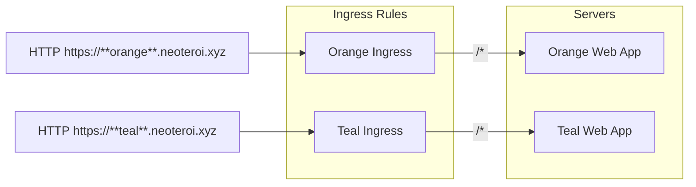

This example shows how to deploy two web workloads, each exposed at their own domain,
having ingress rules configured in the same namespace of the application workload.



## Requirement

Set this in your `hosts` file:

```
127.0.0.1  orange.neoteroi.xyz
127.0.0.1  www.orange.neoteroi.xyz
127.0.0.1  teal.neoteroi.xyz
127.0.0.1  www.teal.neoteroi.xyz
```

On Linux, this file is located at `/etc/hosts`.
On Windows, this file is located at `C:\Windows\System32\drivers\etc\hosts`.
